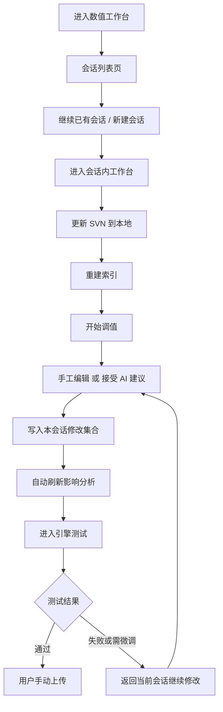
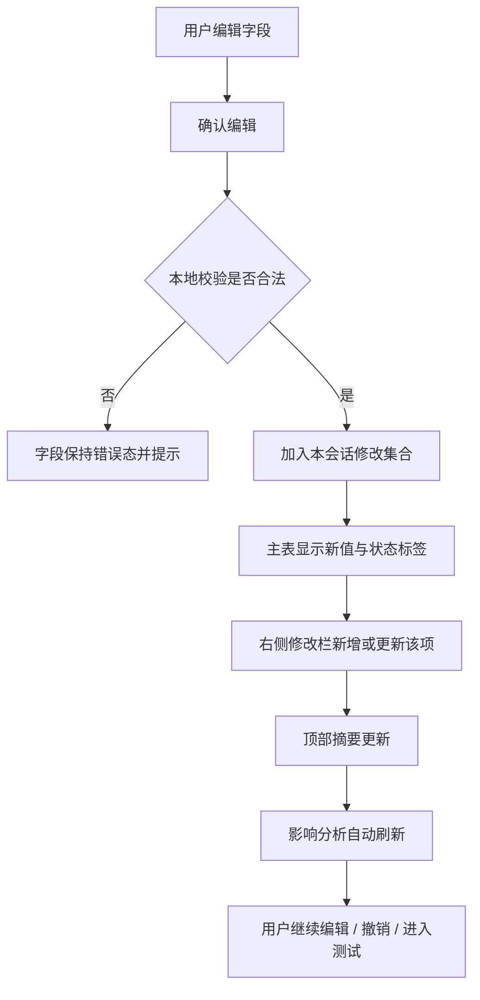
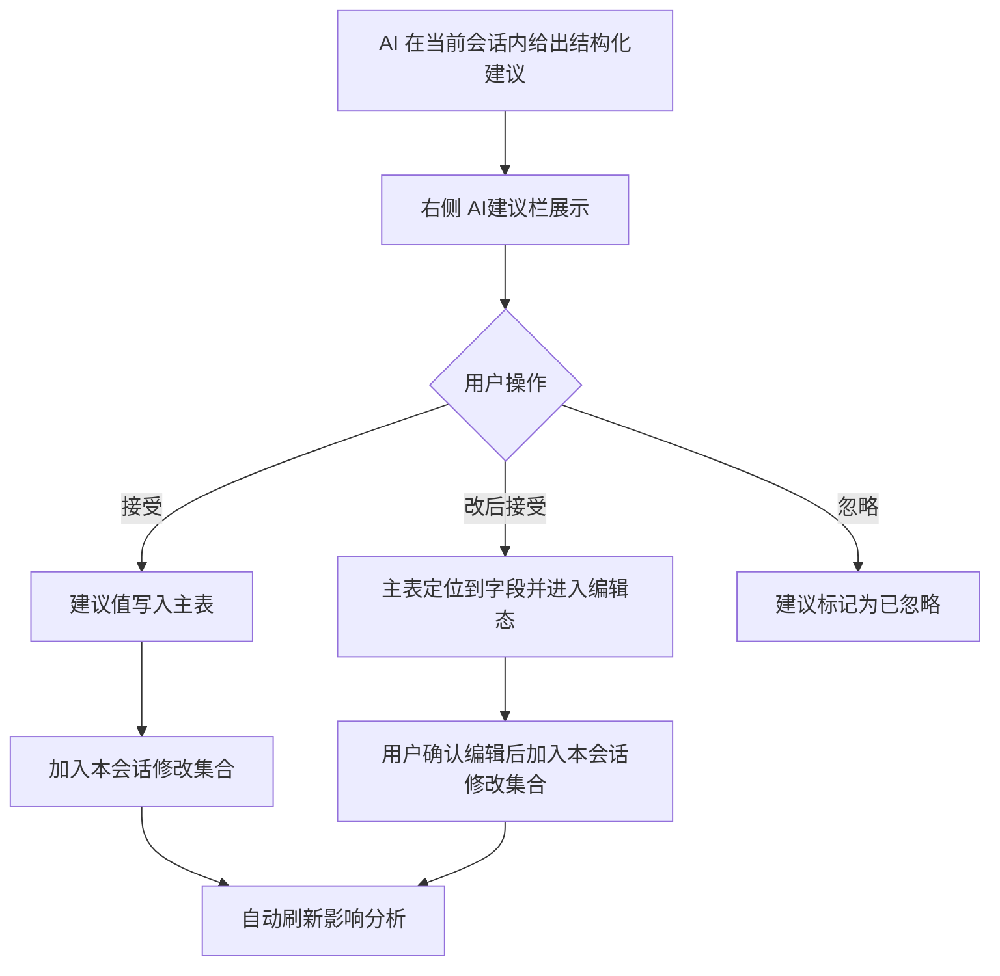
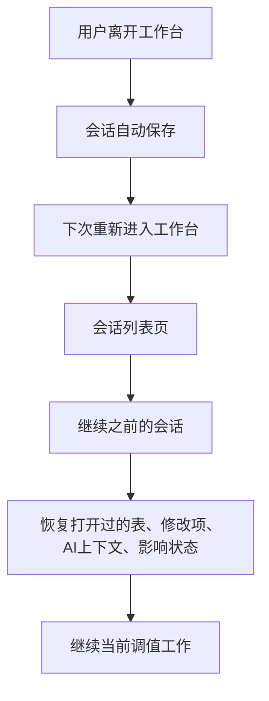

# 数值工作台（会话驱动版）UX 方案与施工文档

> 文档定位：本文档用于重新定义数值策划工作台的交互结构、流程图、UX 原则与施工方案。
>
> 本文档覆盖并替代 [docs/foundations/numeric-workbench-spec.md](/Users/Admin/LTCLaw2.0/docs/foundations/numeric-workbench-spec.md) 中以下旧设计：
> - “生成变更草稿”
> - “提交 / 审批 / 写回 SVN” 作为数值工作台主流程
> - “右侧 Drawer” 作为弹窗级临时信息区
>
> 本文档对应的真实使用前提：
> - 数值工作台只做本地修改
> - SVN 在该模块中只承担“更新 / 下载”职责
> - 用户在引擎内测试
> - 验证通过后，用户自行手动上传
> - 用户需要在同一个工作会话里持续修改、回退、继续 AI 协作

## 0. 2026-05-06 实施状态（主线对齐）

截至 2026-05-06，本文档描述的“会话驱动版”已成为当前主线实现基线，不再只是 UX 方案。

已落地主干：

- `NumericWorkbench` 已切成 `会话列表页 -> 会话内工作台页` 双态结构
- 会话内状态已统一收口到 `useWorkbenchSessions`，覆盖 messages、dirtyCells、openTables、activeTab、pinnedTab、searchByTable、highlight、lastManualSavedAt
- 会话操作已明确收口为：`切换 / 新建 / 重命名 / 删除`，复制会话入口已移除
- 删除会话入口已在会话卡片和会话工具条中直出，不再藏在深层菜单中
- 工作台右侧区域已固定为常驻 side panel，不再使用旧版临时 Drawer 作为核心工作区
- `保存当前会话` 与 `导出草稿` 已拆成两个动作；导出后不再清空本地 dirty，便于持续调值
- URL 深链已与 `session / table / tableId / row / rowId / field / fieldKey` 同步，支持从 AI 建议、跳转定位、tab 切换等路径回写当前上下文
- Chat 联动已贯通：工作台可推送 `numeric_table / draft_doc` 卡片；草稿卡片可直接打开 proposal 管理抽屉

当前未完全闭合项：

- 文档库仍未成为数值工作台导出草稿的真实承载面，当前更多依赖 proposal drawer 承接后续动作
- reverse-impact 的更完整摘要尚未作为稳定主视图收口，现阶段仍以 preview / damage chain / affected tables 为主
- 真实 SVN / 真实 LLM / 多 reviewer 的生产联调仍需专项回归，不能只以本地前端构建绿代替

实现备注：

- 当前运行时优先读取包内静态资源目录 `src/ltclaw_gy_x/console`，因此前端源码修改后必须执行 `console` 构建并同步产物，不能只改 `console/src`
- 本文档优先级高于旧版 `docs/foundations/numeric-workbench-spec.md` 中“生成变更草稿 / 提交审批 / 右侧 Drawer 为核心工作区”的描述

---

## 1. 设计结论

### 1.1 产品定位

数值工作台不是“远端变更系统”，而是：

**带会话记忆的本地数值调试工作台**

它服务的真实链路是：

1. `更新 SVN 到本地`
2. `重建索引`
3. `LLM 进入当前会话，给出改表建议`
4. `用户手工修改或接受 AI 建议`
5. `进入引擎测试`
6. `测试失败时返回当前会话继续修改或撤销`
7. `测试通过后，用户自行手动上传`

### 1.2 明确边界

数值工作台负责：

- 本地更新后的索引重建
- 会话级调值上下文管理
- AI 建议接入与采纳
- 主表编辑与多表参考
- 会话内修改记录
- 会话内撤销与继续编辑
- 会话内影响分析

数值工作台不负责：

- 直接上传到 SVN
- 审批流
- 远端写回
- 团队协作提案管理

### 1.3 页面层级

整体交互拆成两个页面层级：

1. `会话列表页`
   - 居中全屏
   - 作为工作入口
   - 负责“继续哪个调值会话”

2. `会话内工作台页`
   - 只服务当前会话
   - 主工作区 + 常驻右侧功能栏
   - 95% 功能都必须与当前调值动作强相关

---

## 2. 信息架构

### 2.1 页面结构

#### A. 会话列表页

- 作用：选择或创建一个调值会话
- 风格：居中全屏入口页
- 不承担具体改表行为

#### B. 会话内工作台页

- 作用：在当前会话中持续调值
- 页面拆分为：
  - 顶部状态与基础动作区
  - 中部主工作区
  - 右侧常驻功能栏
  - 底部 AI 意图输入区

### 2.2 右侧功能栏收敛

右侧功能栏只保留三类强相关内容：

- `修改`
- `影响`
- `AI建议`

以下内容不允许常驻在右侧：

- 会话列表
- 归档管理
- 会话切换总览
- 复杂配置说明
- 非当前会话相关的系统信息

会话列表、历史回看等次级动作应通过独立入口页或次级弹层承载。

---

## 3. 核心流程图

### 3.1 顶层业务流程



### 3.2 会话内编辑流程



### 3.3 AI 建议采纳流程



### 3.4 本地会话延续流程



---

## 4. UX 方案

### 4.1 会话列表页

#### 目标

在进入具体调值之前，先确定当前工作上下文。

#### UX 原则

- 它是工作入口，不是工具菜单
- 必须是居中全屏页面，层级高于工作台
- 视觉上像“继续工作”，而不是“管理数据”
- 会话卡片只展示继续工作所需的最小信息

#### 页面内容

- 页面标题：`数值工作台`
- 副标题：`选择一个调值会话继续工作`
- 会话卡片：
  - 会话名称
  - 基线 SVN revision
  - 本会话修改数量
  - 上次编辑时间
  - `继续会话`
- 底部主动作：`新建会话`

#### 不要做成什么

- 不要做成表格管理页
- 不要在这里堆归档、筛选、权限、过多元数据
- 不要用下拉菜单或顶部小弹窗替代

### 4.2 会话内工作台页

#### 结构

1. 顶部状态与基础动作区
2. 中部主工作区
3. 右侧常驻功能栏
4. 底部 AI 意图输入区

#### 顶部区

只保留当前动作强相关的信息：

- 当前会话名
- 当前主表 / 记录上下文
- `本会话修改 N 项`
- `影响 N 张表`
- `AI 建议 N 条`
- `更新 SVN`
- `重建索引`
- `返回会话列表`

禁止在顶部长期展示：

- 大块会话元信息
- 冗长历史
- 复杂流程说明
- 审批 / 远端状态

### 4.3 主工作区

#### 主编辑表

主工作区始终只有一个“主编辑表”。

要求：

- 真正承担编辑动作
- 当前记录要明确
- 当前行 / 当前字段高亮
- 支持键盘连续编辑
- 编辑确认后直接进入本会话修改集合

字段显示建议：

```text
DamageCoeff   1.00 -> 1.20   [本会话修改]
CostSP        20   -> 24     [AI接受]
BuffID        null -> 3101   [待确认]
```

#### 参考表

参考表用于解决“多表来回查看”，不是第二编辑中心。

规则：

- 最多 2 张参考表
- 默认只读
- 可钉住
- 可一键升级为主表
- 从 AI 建议或影响分析中点击后自动打开

### 4.4 右侧常驻功能栏

#### 基本原则

- 常驻在页面中，不是 Drawer，不是弹窗
- 支持拖拽调宽
- 支持折叠
- 只展示当前会话调值强相关内容

#### 宽度规则

- 默认宽度：`420px`
- 最小宽度：`320px`
- 最大宽度：`620px`
- 用户拖拽结果本地持久化

#### Tab 结构

##### Tab 1：修改

作用：展示本会话内所有已确认修改。

每条修改必须提供：

- `编辑`
- `撤销`
- `定位`

底部集合动作：

- `撤销本步`
- `清空本会话修改`

这里不允许出现：

- `提交变更`
- `送审`
- `上传 SVN`

##### Tab 2：影响

作用：展示当前本会话修改带来的业务影响。

展示顺序：

1. 结论层
   - 影响几张表
   - 影响几个引用点
   - 核心业务结果变化
   - 是否超出建议区间

2. 细节层
   - 具体影响表
   - 链路详情
   - 定位到对应修改

禁止直接默认展示纯技术依赖边列表。

##### Tab 3：AI建议

作用：承接 LLM 在当前会话内产出的结构化建议。

每条建议必须包含：

- 表名
- row_id
- 字段
- 当前值
- 建议值
- 建议原因
- 建议依据

每条建议动作：

- `接受`
- `改后接受`
- `忽略`
- `定位`

### 4.5 底部 AI 意图输入区

#### 作用

把“聊天”降级成“当前会话的意图输入器”。

它的职责是：

- 描述本轮调值目标
- 触发 AI 在当前会话内生成建议
- 继承当前主表、参考表和最近修改上下文

不应该做成：

- 独立聊天主界面
- 抢占主视觉中心
- 长篇大段自然语言对话堆叠

推荐表现：

- 一条当前意图说明
- 一个输入框
- 一个主动作：`让 AI 分析`

---

## 5. 关键交互细则

### 5.1 确认单条编辑后的交互

用户编辑字段并确认后：

1. 本地校验
2. 合法则加入本会话修改集合
3. 主表刷新为新值
4. 右侧 `修改` 栏新增或更新该项
5. 顶部摘要更新
6. 右侧 `影响` 自动刷新

如果非法：

1. 不写入本会话修改集合
2. 字段保持错误态
3. 给出明确错误提示

### 5.2 接受 AI 建议后的交互

用户点击 `接受`：

1. 建议值写入主表
2. 字段标记为 `AI接受`
3. 进入本会话修改集合
4. 影响自动刷新

用户点击 `改后接受`：

1. 主表定位到目标字段
2. 预填 AI 建议值
3. 用户确认后按普通编辑流程进入本会话修改集合

### 5.3 更新 SVN 的交互

工作台内 SVN 只承担下载职责。

点击 `更新 SVN`：

1. 更新本地工作副本
2. 不出现任何上传动作
3. 完成后显示最新本地基线 revision

如果当前会话已有修改：

1. 允许继续更新
2. 更新后提示用户重新校验当前会话修改

### 5.4 重建索引的交互

点击 `重建索引`：

1. 基于当前本地文件重建索引
2. 完成后 AI 建议与影响分析使用新索引
3. 不引入提交流程

---

## 6. 页面草图

### 6.1 会话列表页

```text
┌──────────────────────────────────────────────────────────────────────────────┐
│                                                                              │
│                                   数值工作台                                 │
│                            选择一个调值会话继续工作                          │
│                                                                              │
│   ┌──────────────────────────────────────────────────────────────────────┐   │
│   │ 剑士伤害调整                                                         │   │
│   │ 基线 SVN r614525                                                     │   │
│   │ 本会话修改 7 项 · 上次编辑 今天 14:32                                │   │
│   │                                                    [继续会话]        │   │
│   └──────────────────────────────────────────────────────────────────────┘   │
│                                                                              │
│   ┌──────────────────────────────────────────────────────────────────────┐   │
│   │ Boss平衡测试                                                         │   │
│   │ 基线 SVN r614520                                                     │   │
│   │ 本会话修改 3 项 · 上次编辑 昨天 18:45                                │   │
│   │                                                    [继续会话]        │   │
│   └──────────────────────────────────────────────────────────────────────┘   │
│                                                                              │
│                                              [新建会话]                     │
│                                                                              │
└──────────────────────────────────────────────────────────────────────────────┘
```

### 6.2 会话内工作台页

```text
┌────────────────────────────────────────────────────────────────────────────────────────────┐
│ 数值工作台 / 剑士伤害调整                                      [返回会话列表] [更新SVN] [重建索引] │
│ SkillTable > 斩击 > row_id=20031        修改 7项 | 影响 2张表 | AI建议 4条                          │
├────────────────────────────────────────────────────────────────────────────────────────────┤
│                                                                                            │
│ 主工作区                                                               │ 功能栏             │
│                                                                        │                    │
│ ┌────────────────────────────────────────────────────────────────────┐ │ [修改 7][影响 2]  │
│ │ 主编辑表：SkillTable                                               │ │ [AI建议 4]        │
│ │ 当前记录：斩击                                                      │ │                    │
│ │                                                                    │ │ 1. DamageCoeff     │
│ │ DamageCoeff   1.00 -> 1.20   [本会话修改]                          │ │ 1.00 -> 1.20      │
│ │ CostSP        20   -> 24     [AI接受]                              │ │ [编辑][撤销][定位] │
│ │ BuffID        null -> 3101   [待确认]                              │ │                    │
│ │ CritRate      0.15 -> 0.18   [超区间]                              │ │ 2. CostSP          │
│ └────────────────────────────────────────────────────────────────────┘ │ 20 -> 24          │
│                                                                        │ [编辑][撤销][定位] │
│ ┌────────────────────────────────────────────────────────────────────┐ │                    │
│ │ 参考表 1：HeroTable                                                │ │ 3. BuffID          │
│ │ 默认只读                                                           │ │ null -> 3101       │
│ └────────────────────────────────────────────────────────────────────┘ │ [编辑][撤销][定位] │
│                                                                        │                    │
│ ┌────────────────────────────────────────────────────────────────────┐ │ [撤销本步]        │
│ │ 参考表 2：BuffTable                                                │ │ [清空本会话修改]  │
│ │ 默认只读                                                           │ │                    │
│ └────────────────────────────────────────────────────────────────────┘ │ [折叠]             │
│                                                                        │                    │
│ ──────────────────────── 可拖拽分隔条 ─────────────────────────────── │                    │
│                                                                        │                    │
│ AI 意图输入区                                                          │                    │
│ ┌────────────────────────────────────────────────────────────────────┐ │                    │
│ │ 当前意图：增强斩击伤害，但不要超同类区间太多                      │ │                    │
│ │ [______________________________________________] [让AI分析]        │ │                    │
│ └────────────────────────────────────────────────────────────────────┘ │                    │
│                                                                                            │
└────────────────────────────────────────────────────────────────────────────────────────────┘
```

---

## 7. 施工方案

### 7.1 目标拆分

施工分成三阶段：

1. `入口层改造`
2. `会话内工作台结构改造`
3. `会话能力补全`

### 7.2 第一阶段：入口层改造

目标：把会话入口从工作台主界面剥离，建立独立的会话列表页。

前端任务：

- 新增 `会话列表页`
- 支持：
  - 展示已有会话
  - 继续会话
  - 新建会话
- 从工作台页提供 `返回会话列表`

建议文件：

- `console/src/pages/Game/NumericWorkbenchSessions.tsx`
- `console/src/pages/Game/NumericWorkbenchSessions.module.less`

路由建议：

- `/numeric-workbench/sessions`
- `/numeric-workbench/:sessionId`

### 7.3 第二阶段：会话内工作台结构改造

目标：把当前数值工作台收敛为“主工作区 + 常驻右侧功能栏”。

前端任务：

- 重构 [console/src/pages/Game/NumericWorkbench.tsx](/Users/Admin/LTCLaw2.0/console/src/pages/Game/NumericWorkbench.tsx)
- 右侧从“抽屉感”改为“页面内常驻栏”
- 支持拖拽宽度
- 支持折叠
- 只保留三类强相关 tab：
  - 修改
  - 影响
  - AI建议

建议拆分组件：

- `NumericWorkbenchLayout`
- `WorkbenchSessionHeader`
- `WorkbenchPrimaryTable`
- `WorkbenchReferenceTables`
- `WorkbenchRightPanel`
- `WorkbenchRightPanelTabs`

### 7.4 第三阶段：会话能力补全

目标：让修改、AI 建议、影响分析都绑定到当前会话。

后端任务：

- 为工作台增加 `session_id` 维度
- 当前会话下持久化：
  - 打开过的表
  - 主表
  - 参考表
  - 当前修改集合
  - AI 建议集合
  - 最近意图上下文
- 更新 SVN、重建索引后保留当前会话

前端任务：

- 所有 `preview / suggest / ai-suggest / context` 请求附带 `session_id`
- 右侧 `修改` 视图消费“当前会话修改集合”
- AI 建议视图消费“当前会话建议集合”

### 7.5 施工优先级

#### P0

- 会话列表页
- 会话内工作台页结构收敛
- 右侧常驻功能栏
- 删除旧的“提交 / 草案 / 审批”文案

#### P1

- 会话级修改集合持久化
- AI 建议与当前会话绑定
- 更新 SVN / 重建索引与当前会话联动

#### P2

- 会话历史回看
- 更细的回退能力
- 参考表升主表的细节优化
- 键盘连续编辑强化

---

## 8. 对现有实现的影响

### 8.1 需要弱化或删除的旧概念

从数值工作台页面中移除：

- `生成变更草稿`
- `提交变更`
- `proposal`
- `审批`
- `写回 SVN`

这些概念如果保留，应只存在于其他模块，不应污染数值工作台主流程。

### 8.2 与当前代码最直接相关的区域

前端重点：

- [console/src/pages/Game/NumericWorkbench.tsx](/Users/Admin/LTCLaw2.0/console/src/pages/Game/NumericWorkbench.tsx)
- [console/src/pages/Game/components/ImpactPanel.tsx](/Users/Admin/LTCLaw2.0/console/src/pages/Game/components/ImpactPanel.tsx)
- `WorkbenchChat` 相关组件

后端重点：

- [src/ltclaw_gy_x/app/routers/game_workbench.py](/Users/Admin/LTCLaw2.0/src/ltclaw_gy_x/app/routers/game_workbench.py)
- 当前会话上下文和工作台状态存储逻辑

---

## 9. 验收标准

完成后应满足：

1. 用户进入数值工作台时，先看到独立的会话列表页，而不是直接进入调值页面。
2. 用户进入某会话后，主工作台只展示当前调值强相关内容。
3. 右侧功能栏常驻在页面里，可调宽、可折叠，不是弹窗级 Drawer。
4. 右侧功能栏只保留 `修改 / 影响 / AI建议` 三类内容。
5. 工作台中不存在“提交到 SVN”或“审批写回”的主流程表达。
6. 更新 SVN 与重建索引是顶部基础动作，不与本地修改集混淆。
7. 用户离开后重新进入同一会话，能恢复会话上下文并继续工作。

---

## 10. 最终原则

这版数值工作台的最终原则只有三条：

1. `会话先于调值`
2. `工作台只做本地调值，不做远端提交流程`
3. `主界面的绝大部分功能都必须和当前调值动作强相关`
