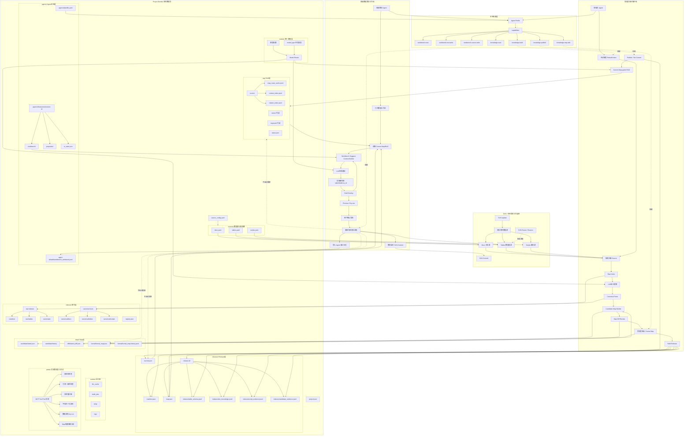
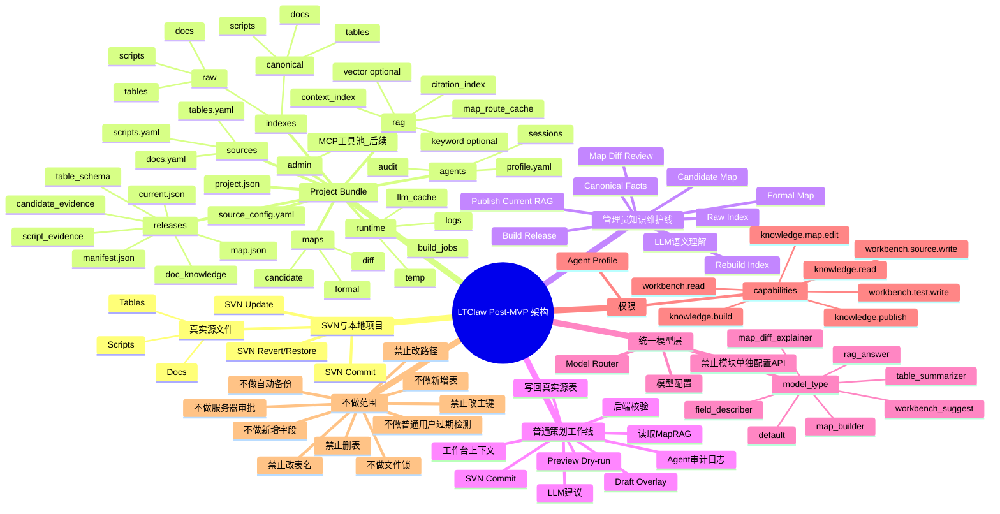
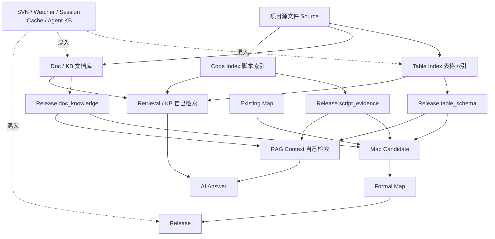
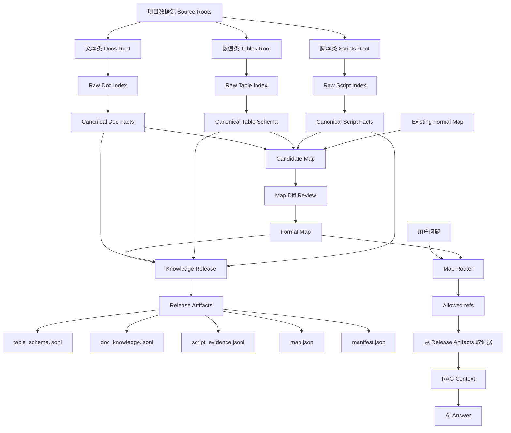
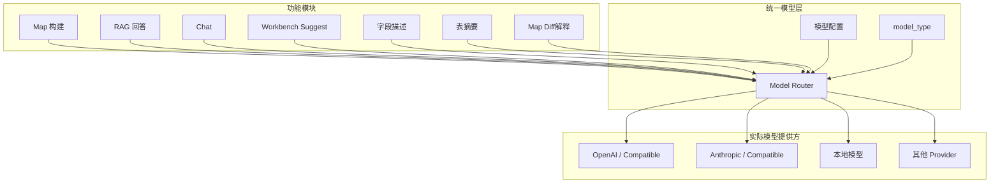
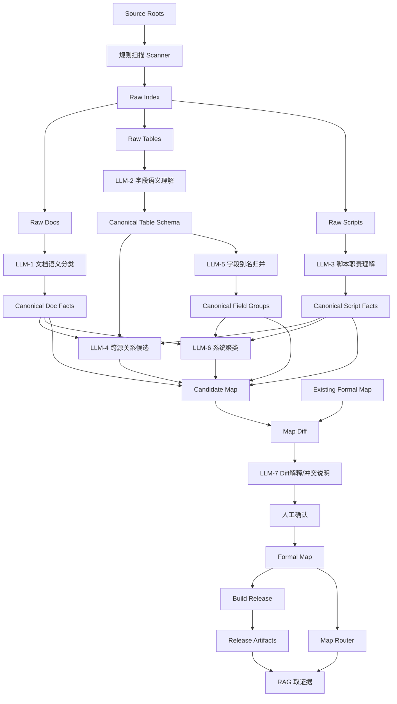
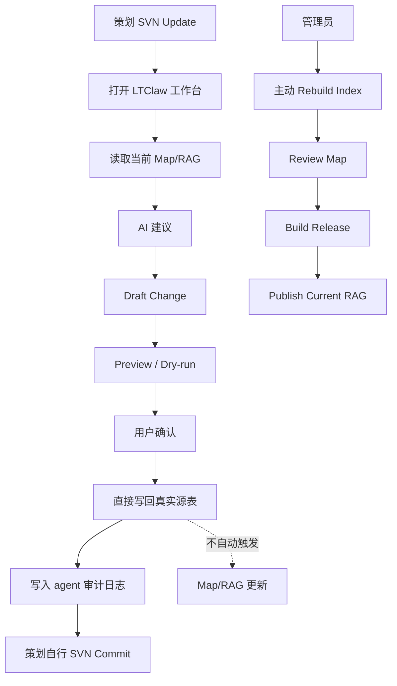
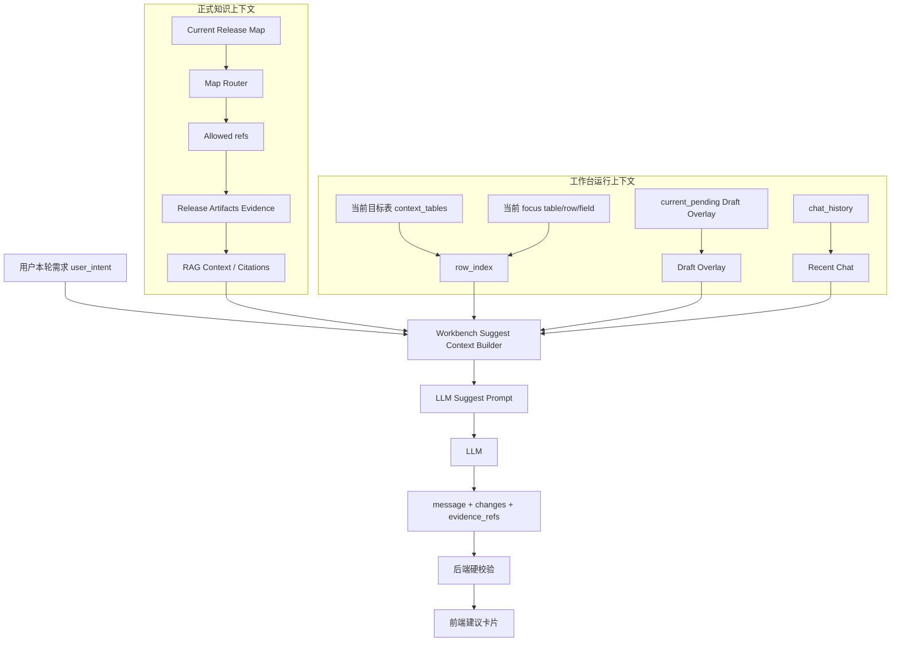

# LTClaw Post-MVP 架构稳定化设计文档

## 0. 文档目的

本文档用于收口 LTClaw 在 Post-MVP 阶段的核心架构方向，重点覆盖：

1. Map-first 知识架构。
2. RAG 从属化，不再自行整理项目知识结构。
3. 项目数据、Map 数据、Release 数据、RAG 数据的统一项目数据包管理。
4. 数值策划工作台如何消费 Map/RAG，并将 Draft Change 写回真实项目表文件。
5. 普通策划与管理员之间的角色边界。
6. 本地 Agent Profile 权限管理方案。
7. LLM 在 Map 构建和数值建议中的介入时机。
8. 当前阶段明确不做的能力范围。

本文档不是 MVP 重开文档，而是 Post-MVP 架构稳定化文档。既有 MVP 结论保持不变，本阶段目标是把业务边界和技术边界重新收口，使后续功能开发更可控。

---

## 1. 总体结论

LTClaw 不应该做成中心化协同平台，而应该定位为：

> 本地智能策划工作台 + 管理员维护的项目知识底座。

其中：

- SVN 负责多人同步、版本恢复、冲突处理。
- LTClaw 负责本地 AI 辅助、数据编辑、Map/RAG 知识消费、管理员知识发布。
- Agent Profile 负责本地角色边界，不做服务端账号系统。
- 普通策划可以直接写回真实项目表文件，但不能更新 Formal Map、Current Release 或正式 RAG。
- 管理员手动触发 Map/RAG/Release 的重建和发布。

最终原则：

```text
管理员管知识底座，策划用知识底座改业务数据。
Map 管结构，Artifacts 管证据，RAG 管查询，Workbench 产草案并写回真实表。
正式知识查询只保留一套 Map-gated RAG，不再保留 KB 作为正式知识系统。
所有 LLM 调用统一走已配置的模型路由，不在 Map/RAG/Chat/Workbench 内部分别配置 API。
```

---

## 1.1 当前版本完整架构导图

本导图是当前 Post-MVP 收口版本的完整模块视图，覆盖项目数据包、数据源、Map/RAG 知识底座、管理员维护线、普通策划工作线、真实表写回、权限、审计日志和后续 MCP 工具池。



### 1.2 模块关系总览



---

## 2. 新旧架构对比

### 2.1 旧架构问题

旧架构中，Map、RAG、Release、KB、Retrieval、Session Cache 都有机会独立整理数据。



旧架构主要问题：

1. RAG 和 Map 并列读数据，RAG 可能自行整理知识结构。
2. Release 可能依赖 agent/session 私有数据，导致 project-level 正式产物不闭合。
3. Map Candidate 从 Release Artifacts 反推，缺少从 Source/Canonical Schema 重建的正式路径。
4. Project、Agent、Session、Runtime Cache 混读，路径和数据所有权不清晰。
5. 数值工作台 AI 建议依赖表格上下文和 dependency graph，但未真正接入 Current Map/RAG。
6. 普通策划修改源数据后，知识底座是否更新缺少清晰边界。

---

### 2.2 新架构方向

新架构采用 Map-first：



新架构核心原则：

```text
Map 是项目知识的编排层。
RAG 不允许自行构建独立的项目知识结构。
RAG 只能在当前 Release Map 暴露的 refs 范围内取证、排序、组装上下文。
Release Artifacts 是证据仓库，不是知识图谱。
```

---

## 3. 核心概念定义

### 3.1 Source 数据源

Source 是项目真实数据所在位置，分为三类：

1. 文本类 Docs：策划文档、规则说明、Markdown、TXT、HTML 等。
2. 数值类 Tables：Excel、CSV、TXT 表、配置表、数值表。
3. 脚本类 Scripts：C#、Lua、Python、TS 等代码源。

Source 是事实来源，但普通 RAG 不直接读 Source。Source 由管理员在构建知识底座时扫描。

---

### 3.2 Raw Index 原始索引

Raw Index 是规则层从 Source 中读取出的原始结构。

示例：

- Raw Table Index：表名、表头、字段类型、样本值、行数、source_hash。
- Raw Doc Index：标题、路径、摘要候选、source_hash。
- Raw Script Index：类、方法、symbol、reference、source_hash。

Raw Index 必须由规则层生成，不允许 LLM 决定底层文件是否可读。

---

### 3.3 Canonical Facts 规范化事实层

Canonical Facts 是 Raw Index 经过规则和 LLM 语义理解后的规范化知识事实。

重点是 Canonical Table Schema：

```json
{
  "raw_header": "Atk",
  "canonical_header": "attack",
  "aliases": ["Atk", "Attack", "攻击力"],
  "semantic_type": "combat_stat",
  "description": "技能攻击力字段",
  "confidence": 0.86,
  "confirmed": false
}
```

Canonical Facts 是 Map 构建的关键输入。没有这层，Map 会直接被 raw header、字段描述质量、表头漂移拖垮。

---

### 3.4 Candidate Map 候选 Map

Candidate Map 是系统根据 Canonical Facts、已有 Formal Map、LLM 关系候选和规则推断生成的建议态 Map。

Candidate Map 不是正式知识结构。它用于：

1. 给管理员审查。
2. 显示新增/删除/变化项。
3. 提供系统聚类和关系候选。
4. 作为 Formal Map 更新的候选来源。

---

### 3.5 Formal Map 正式 Map

Formal Map 是管理员确认后的正式项目知识结构。

Formal Map 负责回答：

1. 项目有哪些系统。
2. 每个系统有哪些表、文档、脚本。
3. 表、文档、脚本之间有什么关系。
4. 哪些对象 active、ignored、deprecated。

Formal Map 不应存储全文、完整表数据或完整代码内容。它只存结构、引用、关系和状态。

---

### 3.6 Release

Release 是某一次知识发布的快照。

Release 包含：

1. manifest.json
2. map.json
3. indexes/table_schema.jsonl
4. indexes/doc_knowledge.jsonl
5. indexes/script_evidence.jsonl
6. indexes/candidate_evidence.jsonl

Release 的作用：

- 固化某一刻的知识状态。
- 让 RAG 在稳定证据上回答。
- 支持回滚和可复现。
- 将 Formal Map 和 Canonical Facts 快照化。

---

### 3.7 Release Artifacts

Release Artifacts 是某次 Release 下的只读证据快照包。

定位：

```text
Map = 知识结构 / 导航图
Release Artifacts = 证据仓库 / 快照数据
RAG = 按 Map 指路，从 Artifacts 里取证据并组织上下文
```

Artifacts 不承担知识结构编排职责。RAG 必须先经过 Map Router，得到 allowed refs 后，再去 Artifacts 中取证据。

---

### 3.8 RAG

RAG 是查询层，不是知识结构层。

RAG 的职责：

1. 接收用户问题。
2. 通过 Map Router 定位相关 refs。
3. 从 Release Artifacts 取证据。
4. 组织 context。
5. 给 LLM 生成回答。
6. 返回 citations。

RAG 不允许：

1. 自行扫描全部 table_schema/doc_knowledge/script_evidence。
2. 自行组织项目系统结构。
3. 绕过 Map 使用 session KB 作为正式知识来源。
4. 把 Draft Change 自动写入正式知识。

---

## 3.9 KB 移除原则

本版本正式移除 KB 作为正式知识系统的定位。

正式知识底座只保留：

```text
Formal Map + Release Artifacts + Map-gated RAG
```

KB 不再作为：

1. Release 输入。
2. RAG 并列检索源。
3. Workbench Suggest 正式证据源。
4. Map 构建正式来源。
5. 普通 Chat 的正式项目知识来源。

如果历史 KB 中存在有价值内容，必须迁移为 project-owned docs/canonical facts 后，再经过：

```text
Canonical Facts → Candidate Map → Formal Map → Release → Map-gated RAG
```

不能再走：

```text
KB → Release
KB → RAG
KB → Workbench Suggest
```

后续代码治理中，凡是出现 `knowledge_base`、`kb_store`、`get_kb_store`、`session/databases/knowledge_base` 参与正式知识链路，都视为 legacy 逻辑，需要移除或降级为迁移工具。

---

## 4. 项目数据包路径设计

### 4.1 统一项目数据包

项目数据、Map 数据、Release 数据、RAG 数据应该封装到一个 project bundle 下。

推荐结构：

```text
<LTCLAW_GAME_PROJECTS_DIR>/
  <project-key>/
    project.json
    source_config.yaml

    sources/
      docs.yaml
      tables.yaml
      scripts.yaml

    indexes/
      raw/
        docs/
        tables/
        scripts/
      canonical/
        docs/
        tables/
        scripts/
      registry.json

    maps/
      candidate/
        latest.json
        history/
      formal/
        formal_map.json
        formal_map.history.jsonl
      diffs/
        latest_diff.json

    releases/
      current.json
      <release-id>/
        manifest.json
        map.json
        indexes/
          table_schema.jsonl
          doc_knowledge.jsonl
          script_evidence.jsonl
          candidate_evidence.jsonl

    rag/
      current/
        context_index.jsonl
        citation_index.jsonl
        map_route_cache.jsonl
      vector/
      keyword/
      status.json

    runtime/
      llm_cache/
      build_jobs/
      temp/
      logs/

    agents/
      <agent-id>/
        profile.yaml
        audit/
          workbench_writeback.jsonl
        sessions/
          <session-id>/
            workbench/
            proposals/
            ui_state.json
```

原则：

```text
Project-level 正式产物不能依赖 session-level 私有状态。
Session / Agent 可以保存偏好、草案、日志和 UI 状态，但不能反向污染 Formal Map / Release / RAG。
```

---

### 4.2 数据源分类配置

不再使用混合 paths 模糊管理，而是分三类配置：

```yaml
project:
  id: ltclaw-demo
  name: LTClaw Demo
  engine: Unity
  language: zh-CN

source_roots:
  project_root: "E:/ltclaw2.0"
  mode: local
  svn_enabled: false

sources:
  docs:
    roots:
      - path: "Docs"
        include:
          - "**/*.md"
          - "**/*.txt"
          - "**/*.html"
        exclude:
          - "**/temp/**"
          - "**/.git/**"
          - "**/.svn/**"
    default_doc_type: design_doc

  tables:
    roots:
      - path: "Config/Tables"
        include:
          - "**/*.xlsx"
          - "**/*.csv"
          - "**/*.txt"
        exclude:
          - "**/~$*"
          - "**/temp/**"
    table_convention:
      header_row: 1
      primary_key_field: ID
      auto_detect_primary_key: true

  scripts:
    roots:
      - path: "Assets/Scripts"
        include:
          - "**/*.cs"
        exclude:
          - "**/Generated/**"
          - "**/EditorOnly/**"
    language: csharp
```

---

## 4.3 统一模型配置与 LLM 调用边界

### 4.3.1 统一模型入口

本版本必须统一所有 LLM 调用入口。

Map、RAG、Chat、Workbench Suggest、字段描述、表摘要、Map Diff 解释等能力都不应各自保存 API Key、Base URL、Provider 或模型名。

统一原则：

```text
所有 LLM 调用 → Model Router → 当前已配置模型
```

禁止出现：

```text
Map 模块单独配置 API
RAG 模块单独配置 API
Chat 模块单独配置 API
Workbench 模块单独配置 API
某个功能私自读取环境变量调用模型
某个功能绕过 Model Router 直连 provider
```

允许出现：

```text
不同任务传入不同 model_type
Model Router 根据配置决定实际 provider/model
```

示例任务类型：

```text
default
field_describer
table_summarizer
map_builder
map_diff_explainer
rag_answer
workbench_suggest
```

这些 `model_type` 只是任务意图，不是独立 API 配置。实际使用哪个模型，由统一模型配置决定。

---

### 4.3.2 模型配置职责

统一模型配置负责：

1. Provider。
2. Model。
3. API Key / 本地模型连接信息。
4. Base URL。
5. temperature。
6. max tokens。
7. timeout。
8. retry。
9. fallback 策略。
10. 不同 model_type 到实际模型的映射。

模块不得直接关心这些细节。

模块只提交：

```text
prompt / messages
model_type
task metadata
optional structured output schema
```

---

### 4.3.3 统一模型调用图



---

### 4.3.4 失败处理

模型调用失败时，失败行为由 Model Router 统一处理。

建议统一处理：

1. timeout。
2. provider error。
3. 空响应。
4. 非 JSON 响应。
5. structured output 解析失败。
6. fallback model。
7. retry 次数。
8. 错误日志。

模块可以定义业务兜底，但不能自己实现 provider 调用。

例如：

```text
字段描述失败 → 返回低置信度字段说明。
表摘要失败 → 返回“<table_name> 数据配置表”。
Workbench Suggest 失败 → 返回明确错误，不生成 changes。
RAG Answer 失败 → 返回模型不可用，不伪造答案。
```

---

### 4.3.5 配置 UI 边界

模型配置只应该出现在一个统一入口，例如：

```text
设置 → 模型配置
```

不允许在以下页面重复出现 API 配置：

1. Map 页面。
2. RAG 页面。
3. Chat 页面。
4. Workbench 页面。
5. Release 页面。
6. Admin Panel 子功能页。

这些页面最多显示：

```text
当前使用模型配置：xxx
当前 model_type：workbench_suggest
```

不能让用户在各模块单独填 API。

---

## 5. LLM 在 Map 构建中的介入时机

### 5.1 LLM 不介入底层读取

这些必须由规则层完成：

1. 文件是否存在。
2. 编码识别。
3. Excel/CSV/TXT 解析。
4. Header row 定位。
5. 空列裁剪。
6. 基础类型推断。
7. source_hash 计算。

原因：底层读取必须稳定、可复现、可调试。

---

### 5.2 LLM 介入点总图



LLM 的责任：

1. 字段语义理解。
2. 字段归一化。
3. 字段别名合并。
4. 主外键候选。
5. 表间关系候选。
6. 文档-表-代码绑定。
7. 系统聚类。
8. Map Diff 解释。

LLM 不负责最终拍板。最终 Formal Map 由管理员确认。

---

## 6. 管理员知识维护线

管理员负责维护知识底座。


管理员可以执行：

1. 扫描 Source。
2. Rebuild Index。
3. 生成 Canonical Facts。
4. 生成 Candidate Map。
5. Review Map Diff。
6. 保存 Formal Map。
7. Build Release。
8. Publish / Set Current。
9. 主动触发知识过期检测。

管理员主观判断何时更新 Map/RAG/Release，不做服务端审批，不做自动化强制发布。

---

## 7. 普通数值策划工作线

普通策划使用当前 Map/RAG 改业务数据。



普通策划可以：

1. 使用当前 Map/RAG 查询知识。
2. 在工作台中获取 AI 修改建议。
3. 生成 Draft Change。
4. Preview / Dry-run。
5. 修改已有单元格。
6. 新增已有表中的行。
7. 确认后写回真实源表。
8. 自行 SVN Commit。

普通策划不能：

1. 更新 Formal Map。
2. Build Release。
3. Publish Current RAG。
4. 自动触发知识重建。
5. 新增字段。
6. 新增表。
7. 删除字段。
8. 删除表。
9. 改表名。
10. 改主键字段。

---

## 8. 工作台写回真实表的边界

### 8.1 导出的重新定义

本阶段的“导出”不是导出新文件，也不是导出补丁格式。

正式定义：

```text
导出 = 将 Draft Change 写回真实数据源表文件。
```

目标是项目中用于构建 Map/RAG 的同一套表文件，例如：

```text
Config/Tables/*.xlsx
Config/Tables/*.csv
Config/Tables/*.txt
```

---

### 8.2 直接写真实表，不做中间文件交付

用户期望：

```text
不要给我一个新文件。
不要给我一个 JSON patch。
不要绕一套额外格式。
直接编辑项目里的表。
```

实现上可以内部使用临时 pending 文件防止写坏半个文件，但用户认知上就是直接写真实源表。

---

### 8.3 不做文件锁

原因：

```text
数据是本地隔离的。
多人通过 SVN 同步。
SVN 负责冲突处理。
```

LTClaw 不做协同锁。

---

### 8.4 不做写入前 source_hash 强校验

原因：

```text
用户必须知道保持数据表是最新的。
```

只保留轻提示：

```text
写回前请确认已 SVN Update 到最新版本。
```

不阻断，不做强校验。

---

### 8.5 不做自动知识过期检测

普通策划工作台不显示“知识过期”。

管理员面板可以保留主动触发按钮：

```text
检查源数据与当前 Release 是否一致
```

但不自动运行，不打扰普通策划。

---

### 8.6 不做自动备份

恢复交给 SVN。

LTClaw 不额外复制一套备份。

---

### 8.7 保留审计日志

写回真实源表后，按 agent 写入审计日志。

推荐路径：

```text
<project-bundle>/
  agents/
    <agent-id>/
      audit/
        workbench_writeback.jsonl
```

单条日志示例：

```json
{
  "event_type": "workbench_writeback",
  "agent_id": "planner_a",
  "session_id": "default",
  "time": "2026-05-13T12:00:00Z",
  "release_id_at_write": "release-xxx",
  "source_files": ["Config/Tables/SkillTable.xlsx"],
  "changes": [
    {
      "table": "SkillTable",
      "row_id": 1001,
      "field": "Damage",
      "old_value": 100,
      "new_value": 120,
      "reason": "提升前期技能伤害"
    }
  ]
}
```

存储策略：

```text
原始日志按 agent 分开存储。
管理员面板可以聚合查看。
```

即：存储分散，查看聚合。

---

## 9. 数值工作台 AI 建议架构

### 9.1 当前现状

当前工作台已有 LLM 建议，但主要依赖：

1. user_intent。
2. context_tables。
3. 当前表字段、字段描述、表摘要。
4. row_index。
5. dependency_graph 相关表。
6. current_pending。
7. chat_history。

它还没有真正接入：

1. Current Release Map。
2. Map Router。
3. Map-gated RAG Context。
4. Release Artifacts citations。
5. evidence_refs。

---

### 9.2 新增 Workbench Suggest Context Builder

需要新增标准上下文构建器。



---

### 9.3 工作台建议的三层上下文

#### 第一层：Formal Knowledge Context

来自当前正式知识底座：

1. Current Release Map。
2. Release Artifacts。
3. Map-gated RAG citations。
4. table_schema。
5. doc_knowledge。
6. script_evidence。

作用：解释字段含义、表间关系、系统归属、代码/文档证据。

#### 第二层：Workbench Runtime Context

来自当前工作台：

1. context_tables。
2. focus table / row / field。
3. row_index。
4. 当前页面表格数据。
5. current_pending。

作用：定位具体 row_id、判断草案冲突、生成可写入 change。

#### 第三层：Conversation Context

来自当前独立工作台对话：

1. chat_history。
2. 本轮 user_intent。
3. 上一轮 assistant 建议。
4. 用户已接受/拒绝的建议。

作用：处理连续指令，例如“再提高一点”“只改刚才那几个”“撤销上一条”。

---

### 9.4 SuggestChange 输出升级

现有 SuggestChange 较简单，应升级为：

```ts
interface SuggestChange {
  table: string;
  row_id: string | number;
  field: string;
  new_value: unknown;
  reason?: string;

  confidence?: number;
  evidence_refs?: EvidenceRef[];
  uses_draft_overlay?: boolean;
  source_release_id?: string;
  source_map_hash?: string;
  validation_status?: "valid" | "invalid" | "needs_review";
}

interface EvidenceRef {
  source_type: "map" | "table_schema" | "doc_knowledge" | "script_evidence" | "draft_overlay";
  ref_id?: string;
  citation_id?: string;
  title?: string;
  source_path?: string;
  field?: string;
  row?: number | string;
}
```

前端建议卡片应显示：

1. 建议值。
2. 修改理由。
3. 证据来源。
4. 是否使用 Draft Overlay。
5. 当前 Release ID。
6. 置信度。
7. 校验状态。

---

### 9.5 后端硬校验

LLM 输出必须经过后端硬校验。

必须校验：

1. table 必须在 context_tables 或允许的目标表集合中。
2. field 必须存在于对应 table 的字段集合中。
3. row_id 必须存在于 row_index 的 primary key 集合中。
4. new_value 类型应与 field type 基本兼容。
5. evidence_refs 必须来自当前上下文允许的 citations。
6. 如果 uses_draft_overlay 为 true，必须能找到相关 current_pending。

原因：prompt 不是安全边界，后端 validator 才是安全边界。

---

## 10. Draft Overlay

Draft Overlay 是当前工作台会话中的草案上下文。

它包括：

1. 当前未写回的 Draft Change。
2. 用户已经接受但未保存的建议。
3. 当前会话内对表格数据的临时理解。
4. 最近对话中与修改相关的上下文。

Draft Overlay 可以参与工作台 LLM 建议，但必须明确标记：

```text
这是草案上下文，不属于正式知识库。
```

它不写入：

1. Formal Map。
2. Current Release。
3. 正式 RAG。
4. Release Artifacts。

---

## 11. 新增字段和新增表

### 11.1 当前阶段不支持

当前阶段不做普通策划自助新增字段和新增表。

原因：新增字段和表属于结构变更，会影响：

1. TableIndex。
2. Canonical Schema。
3. Formal Map。
4. Release table_schema。
5. RAG evidence。
6. 前端表格渲染。
7. Unity/客户端读取逻辑。
8. 脚本引用。
9. 数据源扫描路径。
10. 主键规则。

这会把当前阶段从“数值内容编辑”扩大成“数据结构治理 + Map/RAG schema 重建 + 客户端兼容管理”。

本阶段明确禁止普通工作台执行以下结构变更：

1. 新增字段。
2. 删除字段。
3. 新增表。
4. 删除表。
5. 改表名。
6. 改表路径。
7. 移动表文件。
8. 改主键字段。
9. 改 header row / comment row 结构。
10. 改表文件格式。

新增字段只能作为管理员版本发布的一部分处理。推荐流程：

```text
管理员判断需要新增字段
→ 手动或受控工具修改源表结构
→ Rebuild Raw Index
→ Rebuild / Review Canonical Schema
→ Candidate Map Diff
→ 保存 Formal Map
→ Build Release
→ Publish Current RAG
```

普通策划如果需要新增字段或新增表，只能在团队流程外部向管理员提出需求；LTClaw 当前阶段不内置服务端审批流，也不在普通工作台内提供结构变更入口。

---

### 11.2 当前阶段支持的范围

建议支持：

1. 修改已有单元格。
2. 批量修改已有单元格。
3. 新增已有表中的行。
4. Preview / dry-run。
5. 写回真实源表。

谨慎支持：

1. 删除行，可以暂缓或仅高级权限开放。

不支持：

1. 新增字段。
2. 删除字段。
3. 新增表。
4. 删除表。
5. 改表名。
6. 改主键字段。
7. 移动表路径。

---

### 11.3 新增字段/表的处理方式

不做审批流，不做服务器，不做申请系统。

如果用户要新增字段或表：

```text
请在项目数据源中手动完成结构变更，并由管理员在合适时机重建 Map/RAG。
```

LTClaw 当前只提示不支持，不自动生成服务端申请。

---

## 12. 权限管理：无服务端方案

### 12.1 基本原则

用户不想做服务端，因此权限采用本地 Agent Profile 管理。

定位：

```text
本地权限不是安全防黑客机制；
它是防误操作和区分角色的产品机制。
```

真正的权限和恢复依赖：

1. SVN 权限。
2. SVN 提交记录。
3. 本地 Agent Profile。
4. 写回审计日志。
5. 团队流程。

---

### 12.2 Agent Profile 路径

推荐路径：

```text
<project-bundle>/
  agents/
    <agent-id>/
      profile.yaml
```

策划示例：

```yaml
agent_id: planner_a
display_name: 数值策划A
role: planner
capabilities:
  - knowledge.read
  - knowledge.map.read
  - workbench.read
  - workbench.test.write
  - workbench.test.export
  - workbench.source.write
```

管理员示例：

```yaml
agent_id: admin
display_name: 知识管理员
role: admin
capabilities:
  - "*"
```

---

### 12.3 Capability 设计

已有方向：

```text
knowledge.read
knowledge.build
knowledge.publish
knowledge.map.read
knowledge.map.edit
knowledge.candidate.read
knowledge.candidate.write
workbench.read
workbench.test.write
workbench.test.export
```

建议新增：

```text
workbench.source.write
```

能力说明：

| Capability | 作用 |
|---|---|
| knowledge.read | 读取 release / RAG |
| knowledge.map.read | 读取 Map |
| knowledge.map.edit | 保存 Formal Map |
| knowledge.build | Rebuild / Build Release |
| knowledge.publish | Set Current / Publish |
| knowledge.candidate.read | 读取 Candidate Map |
| knowledge.candidate.write | 生成/更新 Candidate Map |
| workbench.read | 查看数值工作台 |
| workbench.test.write | 生成 Draft / dirty changes |
| workbench.test.export | 导出测试方案或草案 |
| workbench.source.write | 直接写回真实源表 |

---

### 12.4 角色模板

推荐本地角色模板：

```yaml
roles:
  viewer:
    - knowledge.read
    - knowledge.map.read
    - workbench.read

  planner:
    - knowledge.read
    - knowledge.map.read
    - workbench.read
    - workbench.test.write
    - workbench.test.export

  source_writer:
    - knowledge.read
    - knowledge.map.read
    - workbench.read
    - workbench.test.write
    - workbench.test.export
    - workbench.source.write

  admin:
    - "*"
```

---

### 12.5 UI 展示

工作台应显示当前 Agent 权限：

```text
当前 Agent：planner_a
角色：数值策划
权限：
- 可使用 RAG
- 可生成草案
- 可写回源表
- 不可更新 Map
- 不可发布 Release
```

管理员显示：

```text
当前 Agent：admin
角色：知识管理员
权限：
- 可更新 Map
- 可 Build Release
- 可 Publish Current RAG
```

---

## 13. 当前阶段明确不做

为了控制复杂度，本阶段明确不做：

1. 服务端账号系统。
2. 服务端审批流。
3. 软件内 SVN 操作，包括 update、commit、watcher、heartbeat、权限管理和状态轮询。
4. 文件锁。
5. 写入前 source_hash 强校验。
6. 普通用户自动知识过期检测。
7. 自动备份系统。
8. 普通策划新增字段。
9. 普通策划新增表。
10. 删除字段。
11. 删除表。
12. 改表名。
13. 改表路径或移动表文件。
14. 改主键字段。
15. 改 header row / comment row 结构。
16. 自动触发 Map/RAG rebuild。
17. 普通策划更新 Formal Map。
18. 普通策划 Build Release。
19. 普通策划 Publish Current RAG。
20. RAG 绕过 Map 自行整理项目知识。
21. Draft Overlay 自动进入 Formal Map。
22. 中心化审计系统。

---

## 13.1 数据整理工具池的后续方向

当前阶段不实现 LLM 生成数据整理脚本能力。

数据整理、批量检查、迁移辅助、字段归一化检查等能力，后续统一放到 MCP 工具池或管理员工具池中处理。当前文档只保留方向，不进入本阶段开发范围。

后续可考虑的 MCP 工具池能力：

1. 表结构检查工具。
2. 主键 / 外键一致性检查工具。
3. 重复 ID / 空行 / 异常值扫描工具。
4. 表间引用检查工具。
5. 字段归一化报告工具。
6. 数据清洗 dry-run 工具。
7. Map 构建辅助分析工具。

边界保持不变：

1. 普通策划工作台不提供结构变更入口。
2. 不自动删表、改表名、改路径、删字段、改主键。
3. 不自动覆盖源表。
4. 不自动发布 Map/RAG/Release。
5. 新增字段和新增表仍由管理员在版本发布流程中主观处理。

---

## 14. 当前阶段建议优先级

### P0：架构收口和安全边界

1. 明确 Map-first contract。
2. RAG 改为 Map-gated retrieval。
3. 工作台建议引入 Workbench Suggest Context Builder。
4. SuggestChange 增加 evidence_refs。
5. 后端校验 LLM 输出 table/field/row_id。
6. 增加 workbench.source.write capability。
7. 写回真实源表前显示 SVN Update 提示。
8. 写回后按 agent 记录审计日志。

### P1：项目数据包和路径治理

1. 统一 project bundle 路径。
2. Source 按 docs/tables/scripts 分类配置。
3. Project-level maps/releases/rag/runtime/agents 分层。
4. 管理员页面显示路径摘要。
5. 管理员主动触发知识一致性检查。

### P2：Map 构建体验

1. Canonical Schema 层。
2. LLM 字段归一化。
3. LLM 关系候选。
4. LLM 系统聚类。
5. Map Diff Review。
6. LLM Diff 解释。

### P3：体验增强

1. 前端建议卡展示 evidence_refs。
2. 当前知识版本显示。
3. Draft Overlay 明确标记。
4. 管理员聚合查看所有 agent 写回日志。
5. RAG citation 到工作台建议上下文的闭环。

---

## 15. 最终平台定义

LTClaw 的 Post-MVP 目标是：

```text
LTClaw 是一个本地智能数值策划工作台。
它由管理员维护 Map-first 知识底座；
普通数值策划使用当前 Map/RAG 进行数据理解、AI 建议、Draft Change 和真实源表写回；
Draft Change 不污染 Formal Map、Current Release 或正式 RAG；
管理员在合适时机基于 SVN 中的真实项目数据源，手动重建、审查、发布新的 Map/RAG/Release。
```

更短版本：

```text
SVN 仍由团队外部流程负责协作和恢复，但 LTClaw 当前版本不再执行 SVN 操作。
Agent Profile 管本地角色边界。
Map 管知识结构。
Release Artifacts 管证据快照。
RAG 按 Map 取证据。
Workbench 用知识底座改真实业务表。
管理员人工发布新的知识底座。
```

---

## 16. 后续开发 Checklist：大块拆分

本节先按“大块阶段”拆分，不进入具体函数和文件级任务。目标是先确认实施顺序、依赖关系和范围边界。

---

### Phase 0：架构边界冻结

目标：先把本轮讨论形成的架构边界固化，避免开发时反复摇摆。

#### Checklist

- [ ] 确认 LTClaw 定位为“本地智能策划工作台”，不是中心化协同平台。
- [ ] 确认 SVN 负责多人同步、恢复和冲突处理，但 SVN 操作不在 LTClaw 软件内执行。
- [ ] 确认普通策划可以写回真实源表，但不能更新知识底座。
- [ ] 确认管理员手动更新 Map/RAG/Release。
- [ ] 确认当前阶段不做新增字段、新增表。
- [ ] 确认禁止删表、改表名、改表路径、改主键、改 header/comment row。
- [ ] 确认不做服务端账号系统。
- [ ] 确认本版本冻结并隐藏 SVN 相关 UI / 权限 / watcher / commit 能力。
- [ ] 确认不做服务端审批流。
- [ ] 确认不做文件锁。
- [ ] 确认不做自动备份。
- [ ] 确认不做普通用户自动知识过期检测。
- [ ] 确认数据整理脚本生成不进入当前阶段，后续放入 MCP 工具池。
- [ ] 确认 KB 不再作为正式知识系统。
- [ ] 确认正式知识查询只保留 Map-gated RAG。
- [ ] 确认 Release 不再读取 workspace/session KB。
- [ ] 确认所有 LLM 调用统一走模型配置 / Model Router。
- [ ] 确认 Map / RAG / Chat / Workbench 不允许单独配置 API。

#### 输出物

- [ ] 架构边界文档定稿。
- [ ] 当前阶段 Do / Don’t Do 清单定稿。
- [ ] 后续功能拆分基线定稿。

---

### Phase 0.5：SVN 能力冻结与隐藏

目标：将 SVN 从 LTClaw 当前版本的功能面中移除。SVN 仍作为团队外部流程存在，但不再由 LTClaw 执行 update、commit、watch、权限管理或状态轮询。

#### Checklist

- [ ] 隐藏所有 SVN 相关 UI。
- [ ] 移除或隐藏 SVN 权限配置入口。
- [ ] 禁用 SVN watcher。
- [ ] 禁用 SVN heartbeat / polling。
- [ ] 禁用 LTClaw 内部 SVN update 操作。
- [ ] 禁用 LTClaw 内部 SVN commit 操作。
- [ ] 禁用 SVN 状态错误在项目主页展示。
- [ ] 保留本地项目路径作为普通 filesystem root。
- [ ] 将配置中的 `svn_root` 语义逐步改名为 `project_root` 或 `source_root`。
- [ ] 若短期不能改名，内部兼容旧字段，但产品文案不再出现 SVN。
- [ ] 代码层先冻结 SVN 模块，不作为主流程依赖。
- [ ] 后续确认无依赖后，再物理删除 SVN 模块。

#### 输出物

- [ ] SVN 冻结策略。
- [ ] SVN UI 隐藏清单。
- [ ] SVN runtime 禁用清单。
- [ ] `svn_root` 到 `project_root` 的字段迁移计划。

---

### Phase 0.6：正式知识链路与重复系统收口

目标：把“什么是正式知识内容、什么是 legacy / runtime / draft / debug”写进 checklist，避免 KB、retrieval、DependencyGraph、ProposalStore 等旧系统继续作为正式来源混入主链路。

#### 正式知识链路

本阶段必须确认正式链路只有一条：

```text
Source
→ Raw Index
→ Canonical Facts
→ Candidate Map
→ Formal Map
→ Release
→ Release Artifacts
→ Map-gated RAG
→ Chat / Workbench Suggest
```

其中：

```text
Formal Map = 正式知识结构。
Release Artifacts = 正式证据快照。
Map-gated RAG = 唯一正式查询入口。
```

#### Checklist

- [ ] 确认 Formal Map 是唯一正式知识结构。
- [ ] 确认 Release Artifacts 是唯一正式证据快照。
- [ ] 确认 Map-gated RAG 是唯一正式项目知识查询入口。
- [ ] 确认 KB 不再作为正式知识系统。
- [ ] 确认 Release 不再读取 KB / workspace KB / session KB。
- [ ] 确认 RAG 不再读取 KB。
- [ ] 确认 Workbench Suggest 不再读取 KB 作为正式证据。
- [ ] 确认普通 Chat 的项目知识来源只走 Map-gated RAG。
- [ ] 确认 legacy `retrieval.py` 不再作为正式查询入口。
- [ ] 确认 legacy retrieval 仅可作为 debug / migration / fallback 工具。
- [ ] 确认 DependencyGraph 只作为技术索引 / 影响分析证据。
- [ ] 确认 Formal Map relationships 才是正式知识关系。
- [ ] 确认 TableIndex 是 raw / semi-structured index，不是最终正式 schema。
- [ ] 确认 Canonical Schema 是 Map/RAG 使用的正式规范化 schema。
- [ ] 确认 ProposalStore 只是可持久化草案记录。
- [ ] 确认 Draft Overlay 只是当前工作台运行态上下文。
- [ ] 确认 Draft / Proposal 不进入 Formal Map。
- [ ] 确认 Draft / Proposal 不进入 Release。
- [ ] 确认 Draft / Proposal 不进入正式 RAG。
- [ ] 确认 `workbench.test.export` 不等于真实源表写回。
- [ ] 确认真实源表写回必须使用 `workbench.source.write`。
- [ ] 确认 `my_role` 只作为 legacy shortcut。
- [ ] 确认 Agent Profile capabilities 是新权限标准。
- [ ] 确认 SimpleModelRouter 只是过渡桥。
- [ ] 确认正式模型调用走统一 Model Router。
- [ ] 确认 release-based candidate 只用于复核当前 Release。
- [ ] 确认 source/canonical-based candidate 才是管理员更新 Map 的主路径。

#### 输出物

- [ ] 正式知识链路定义。
- [ ] Legacy / Debug / Runtime / Draft 分类表。
- [ ] KB 移除清单。
- [ ] retrieval 降级清单。
- [ ] DependencyGraph 与 Formal Map relationships 边界说明。
- [ ] TableIndex 与 Canonical Schema 边界说明。
- [ ] ProposalStore 与 Draft Overlay 边界说明。
- [ ] 权限旧标准到新标准迁移说明。

---

### Phase 1：Project Bundle 与路径收口

目标：把项目数据、Map、Release、RAG、Agent、Audit 等数据统一收口到 project bundle 下。

#### Checklist

- [ ] 定义 `<project-key>` 生成规则。
- [ ] 定义 project bundle 根目录解析规则。
- [ ] 定义 `project.json`。
- [ ] 定义 `source_config.yaml`。
- [ ] 定义 `sources/docs.yaml`。
- [ ] 定义 `sources/tables.yaml`。
- [ ] 定义 `sources/scripts.yaml`。
- [ ] 定义 `indexes/raw/` 目录结构。
- [ ] 定义 `indexes/canonical/` 目录结构。
- [ ] 定义 `maps/candidate/` 目录结构。
- [ ] 定义 `maps/formal/` 目录结构。
- [ ] 定义 `maps/diffs/` 目录结构。
- [ ] 定义 `releases/` 目录结构。
- [ ] 定义 `rag/` 目录结构。
- [ ] 定义 `runtime/` 目录结构。
- [ ] 定义 `agents/<agent-id>/` 目录结构。
- [ ] 定义 `agents/<agent-id>/audit/workbench_writeback.jsonl`。
- [ ] 定义后续 `admin/` MCP 工具池目录占位。
- [ ] 梳理现有 `paths.py` 与新 project bundle 的映射关系。
- [ ] 标记 legacy path，避免一次性破坏旧数据。

#### 输出物

- [ ] Project Bundle 路径规范。
- [ ] Source 配置规范。
- [ ] 路径迁移策略。
- [ ] Legacy path 兼容策略。

---

### Phase 2：统一模型配置与 Model Router

目标：统一 Map、RAG、Chat、Workbench、字段描述、表摘要等所有 LLM 调用，避免每个模块独立配置 API。

#### Checklist

- [ ] 定义统一模型配置入口。
- [ ] 定义 Model Router 为唯一模型调用入口。
- [ ] 禁止 Map 模块单独配置 API。
- [ ] 禁止 RAG 模块单独配置 API。
- [ ] 禁止 Chat 模块单独配置 API。
- [ ] 禁止 Workbench 模块单独配置 API。
- [ ] 禁止功能模块绕过 Model Router 直连 provider。
- [ ] 定义 model_type 列表：default / field_describer / table_summarizer / map_builder / map_diff_explainer / rag_answer / workbench_suggest。
- [ ] 定义 model_type 到实际模型的映射规则。
- [ ] 定义统一 timeout / retry / fallback。
- [ ] 定义统一空响应和解析失败处理。
- [ ] 定义模型配置 UI 只出现在统一设置页。
- [ ] 各功能页只显示当前模型配置和 model_type，不提供 API 填写入口。

#### 输出物

- [ ] 统一模型配置规范。
- [ ] Model Router 调用规范。
- [ ] model_type 映射表。
- [ ] 模型失败处理策略。
- [ ] 模型配置 UI 边界说明。

---

### Phase 3：本地 Agent Profile 权限体系

目标：在不做服务端账号系统的前提下，用本地 Agent Profile 管理角色边界和能力开关。

#### Checklist

- [ ] 定义 `agent profile.yaml` 格式。
- [ ] 定义 agent_id / display_name / role / capabilities 字段。
- [ ] 定义 role 模板：viewer / planner / source_writer / admin。
- [ ] 补充 capability：`workbench.source.write`。
- [ ] 确认现有 capability：`knowledge.read`。
- [ ] 确认现有 capability：`knowledge.map.read`。
- [ ] 确认现有 capability：`knowledge.map.edit`。
- [ ] 确认现有 capability：`knowledge.build`。
- [ ] 确认现有 capability：`knowledge.publish`。
- [ ] 确认现有 capability：`workbench.read`。
- [ ] 确认现有 capability：`workbench.test.write`。
- [ ] 确认现有 capability：`workbench.test.export`。
- [ ] 定义 `*` 管理员能力。
- [ ] 定义前端按钮隐藏 / disabled 行为。
- [ ] 定义后端接口 capability gate。
- [ ] 定义“本地权限不是安全防黑客机制”的产品说明。
- [ ] 设计当前 Agent 权限展示区。

#### 输出物

- [ ] Agent Profile 配置规范。
- [ ] Capability 列表。
- [ ] Role 模板。
- [ ] 权限展示 UI 规则。
- [ ] 后端接口权限矩阵。

---

### Phase 4：Map-first 知识底座收口

目标：让 Map 成为唯一知识结构编排层，RAG 不再自行整理项目知识结构。

#### Checklist

- [ ] 定义 Formal Map 是正式项目知识结构。
- [ ] 定义 Candidate Map 是建议态，不是正式结构。
- [ ] 定义 Map Diff Review 流程。
- [ ] 定义 Map refs：system / table / doc / script / relationship。
- [ ] 定义 active / ignored / deprecated 状态语义。
- [ ] 确认 Formal Map 不存全文、不存完整表格、不存完整代码。
- [ ] 确认 Release 中 `map.json` 是 Formal Map 的快照。
- [ ] 明确 Candidate Map 的来源：Canonical Facts + Existing Formal Map + LLM 候选。
- [ ] 拆分 candidate-from-release 与 candidate-from-source 的语义。
- [ ] 保留现有 release-based candidate 兼容能力。
- [ ] 新增 source/canonical-based candidate 构建方向。
- [ ] 定义管理员保存 Formal Map 的流程。
- [ ] 定义 Formal Map 修改不会自动 Build Release。

#### 输出物

- [ ] Map-first Contract。
- [ ] Map 数据模型边界说明。
- [ ] Candidate / Formal / Release Map 区分说明。
- [ ] Map Diff Review 大纲。

---

### Phase 5：Canonical Facts / Canonical Schema 层

目标：在 Raw Index 和 Map 之间补上稳定的规范化事实层，降低 Map 构建和维护难度。

#### Checklist

- [ ] 定义 Raw Table Index 与 Canonical Table Schema 的区别。
- [ ] 定义 `raw_header`。
- [ ] 定义 `canonical_header`。
- [ ] 定义 `aliases`。
- [ ] 定义 `semantic_type`。
- [ ] 定义 `description`。
- [ ] 定义 `confidence`。
- [ ] 定义 `confirmed`。
- [ ] 定义字段归一化的规则优先级。
- [ ] 定义 LLM 字段语义理解输入输出。
- [ ] 定义 LLM 字段别名合并输入输出。
- [ ] 定义 Canonical Doc Facts。
- [ ] 定义 Canonical Script Facts。
- [ ] 定义 canonical facts 的持久化路径。
- [ ] 定义 canonical facts 与 Release Artifacts 的关系。

#### 输出物

- [ ] Canonical Schema 数据结构。
- [ ] Canonical Facts 目录规范。
- [ ] 字段归一化规则。
- [ ] LLM 语义分析接口草案。

---

### Phase 6：Map-gated RAG 改造

目标：RAG 必须通过 Map Router 取证据，不允许自由扫描所有 artifacts，不允许读取 KB 作为并列正式知识源。

#### Checklist

- [ ] 定义 Map Router 输入：query + current release + optional focus refs。
- [ ] 定义 Map Router 输出：allowed refs。
- [ ] 定义 allowed refs 到 Release Artifacts 的解析逻辑。
- [ ] 定义 RAG Context Builder 只能读取 allowed refs 对应证据。
- [ ] 定义 citation 格式。
- [ ] 定义 RAG 不读取 raw source。
- [ ] 定义 RAG 不读取 pending。
- [ ] 定义 RAG 不读取 KB。
- [ ] 定义 RAG 不读取普通 session draft，除非作为显式 Draft Overlay。
- [ ] 降级 legacy retrieval 为 debug / fallback。
- [ ] 移除 KB 作为正式查询入口。
- [ ] 避免 `retrieval.py` 成为正式知识结构来源。
- [ ] 定义 answer adapter 只消费 context，不直接读 artifacts。
- [ ] 定义 insufficient_context 行为。

#### 输出物

- [ ] Map-gated RAG 设计说明。
- [ ] Map Router 接口草案。
- [ ] RAG Context Builder 新边界。
- [ ] Legacy retrieval 降级策略。

---

### Phase 7：Release 与 Release Artifacts 收口

目标：Release 成为 Formal Map + Canonical Facts 的快照，Release Artifacts 成为证据仓库；Release 不再依赖 KB。

#### Checklist

- [ ] 定义 Release 由管理员触发 Build。
- [ ] 定义 Release 不自动触发。
- [ ] 定义 Release 不依赖普通策划 Draft Overlay。
- [ ] 定义 Release 不依赖 session 私有 KB。
- [ ] 移除 `_load_approved_doc_entries(workspace)` 作为正式 Release 输入。
- [ ] 将 approved docs / doc facts 收口到 project-owned canonical docs。
- [ ] 定义 `manifest.json`。
- [ ] 定义 `map.json`。
- [ ] 定义 `indexes/table_schema.jsonl`。
- [ ] 定义 `indexes/doc_knowledge.jsonl`。
- [ ] 定义 `indexes/script_evidence.jsonl`。
- [ ] 定义 `indexes/candidate_evidence.jsonl`。
- [ ] 定义 Release Artifacts 的 hash / count 记录。
- [ ] 定义 current release 切换方式。
- [ ] 定义 rollback / set current 行为。
- [ ] 定义 Release 与 RAG current 的关系。

#### 输出物

- [ ] Release 数据结构说明。
- [ ] Release Artifacts 说明。
- [ ] Build / Publish 流程说明。
- [ ] Rollback 策略。

---

### Phase 8：数值工作台 AI 建议补全

目标：把当前基于表格上下文的 LLM 建议升级为“正式知识上下文 + 工作台运行上下文”的双上下文建议。

#### Checklist

- [ ] 定义 Workbench Suggest Context Builder。
- [ ] 接入 Current Release Map。
- [ ] 接入 Map Router。
- [ ] 接入 Map-gated RAG Context。
- [ ] 接入 Release Artifacts citations。
- [ ] 保留当前 context_tables。
- [ ] 保留当前 row_index。
- [ ] 保留 current_pending。
- [ ] 保留 chat_history。
- [ ] 定义 Draft Overlay 输入。
- [ ] 定义 Suggest Prompt 标准模板。
- [ ] 定义 SuggestResponse 增加 `evidence_refs`。
- [ ] 定义 SuggestChange 增加 `confidence`。
- [ ] 定义 SuggestChange 增加 `uses_draft_overlay`。
- [ ] 定义 SuggestChange 增加 `source_release_id`。
- [ ] 定义 SuggestChange 增加 `validation_status`。
- [ ] 前端建议卡展示证据来源。
- [ ] 前端明确区分正式知识与 Draft Overlay。

#### 输出物

- [ ] Workbench Suggest Context Builder 设计。
- [ ] SuggestChange v2 结构。
- [ ] 建议卡 UI 信息结构。
- [ ] Draft Overlay 说明。

---

### Phase 9：工作台写回真实源表

目标：让普通策划在权限允许时，把 Draft Change 直接写回用于构建 Map/RAG 的真实表文件。

#### Checklist

- [ ] 确认写回目标是真实源表，不是新文件。
- [ ] 确认支持已有字段 update_cell。
- [ ] 确认支持已有表 insert_row。
- [ ] 暂缓 delete_row 或仅高级权限开放。
- [ ] 禁止新增字段。
- [ ] 禁止新增表。
- [ ] 禁止删除字段。
- [ ] 禁止删除表。
- [ ] 禁止改表名。
- [ ] 禁止改表路径。
- [ ] 禁止改主键。
- [ ] 写回前显示 SVN Update 提示。
- [ ] 不做 source_hash 强校验。
- [ ] 不做文件锁。
- [ ] 不做自动备份。
- [ ] 写回成功后记录 agent audit。
- [ ] 写回后不自动触发 Rebuild。
- [ ] 写回后不自动触发 Publish。

#### 输出物

- [ ] Workbench Source Write 规则。
- [ ] 写回真实表 UX 流程。
- [ ] 禁止结构变更清单。
- [ ] 写回成功 / 失败返回格式。

---

### Phase 10：Agent 审计日志

目标：按 agent 分开记录真实源表写回行为，支持本地追溯和管理员聚合查看。

#### Checklist

- [ ] 定义 `workbench_writeback.jsonl` 路径。
- [ ] 定义日志字段：event_type。
- [ ] 定义日志字段：agent_id。
- [ ] 定义日志字段：session_id。
- [ ] 定义日志字段：time。
- [ ] 定义日志字段：release_id_at_write。
- [ ] 定义日志字段：source_files。
- [ ] 定义日志字段：changes。
- [ ] 定义 old_value / new_value。
- [ ] 定义 reason。
- [ ] 定义写回失败是否记录。
- [ ] 定义管理员聚合查看多个 agent 日志。
- [ ] 不做中心化审计服务。

#### 输出物

- [ ] Agent 审计日志格式。
- [ ] 写回日志持久化规则。
- [ ] 管理员聚合查看设计。

---

### Phase 11：管理员操作面板

目标：把 Map/RAG/Release 的管理员能力集中到清晰的本地管理入口。

#### Checklist

- [ ] 显示当前 project bundle 路径。
- [ ] 显示 source config 路径。
- [ ] 显示当前 Release ID。
- [ ] 显示当前 Map hash。
- [ ] 显示 RAG status。
- [ ] 显示 Formal Map 状态。
- [ ] 提供 Rebuild Index 按钮。
- [ ] 提供 Candidate Map 生成按钮。
- [ ] 提供 Map Diff Review 入口。
- [ ] 提供 Save Formal Map 操作。
- [ ] 提供 Build Release 按钮。
- [ ] 提供 Publish / Set Current 操作。
- [ ] 提供主动知识一致性检查按钮。
- [ ] 提供 agent audit 聚合查看入口。
- [ ] 不向普通策划展示管理员操作。

#### 输出物

- [ ] Admin Panel 信息架构。
- [ ] 管理员操作权限矩阵。
- [ ] 管理员操作确认流程。

---

### Phase 12：后续 MCP 管理员工具池

目标：把数据整理、批量检查、清洗 dry-run、字段归一化报告等能力留给后续 MCP 工具池，不进入当前阶段核心范围。

#### Checklist

- [ ] 定义 MCP Tool Pool 作为后续方向。
- [ ] 表结构检查工具。
- [ ] 主键 / 外键一致性检查工具。
- [ ] 重复 ID / 空行 / 异常值扫描工具。
- [ ] 表间引用检查工具。
- [ ] 字段归一化报告工具。
- [ ] 数据清洗 dry-run 工具。
- [ ] Map 构建辅助分析工具。
- [ ] 明确 MCP 工具池不自动删表。
- [ ] 明确 MCP 工具池不自动改表名。
- [ ] 明确 MCP 工具池不自动改路径。
- [ ] 明确 MCP 工具池不自动发布 Map/RAG/Release。

#### 输出物

- [ ] MCP Tool Pool 后续规划。
- [ ] 管理员工具池边界说明。

---

## 18. 重复系统与职责重叠治理清单

本节用于识别和治理类似 `KB vs RAG` 这种“双系统并存、职责重叠、绕过主链路”的问题。原则是：

```text
只要某个模块能绕过 Map/RAG/Agent Profile/Model Router 自己形成一套正式逻辑，就要降级、合并或移除。
```

---

### 18.1 KB vs Map-gated RAG

最终决策：

```text
KB 从正式知识链路中移除。
正式知识查询只保留 Map-gated RAG。
```

正式知识底座只包括：

```text
Formal Map + Release Artifacts + Map-gated RAG
```

KB 不再作为：

1. Release 输入。
2. RAG 并列检索源。
3. Workbench Suggest 正式证据源。
4. Map 构建正式来源。
5. 普通 Chat 的正式项目知识来源。

代码治理要求：

1. `knowledge_release_service.py` 不再从 workspace/session KB 读取 approved docs。
2. `_load_approved_doc_entries(workspace)` 不再作为正式 Release 输入。
3. `knowledge_base` / `kb_store` / `get_kb_store` / `session/databases/knowledge_base` 不得参与正式知识链路。
4. 历史 KB 内容如果仍有价值，必须迁移为 project-owned docs/canonical facts 后，再进入 Candidate Map / Formal Map / Release / RAG。

---

### 18.2 `retrieval.py` vs `knowledge_rag_context.py`

问题：

```text
retrieval.py 可能形成旧的统一搜索入口；
knowledge_rag_context.py 是 Release-based RAG context；
如果两者都作为正式查询入口，就会形成两套 RAG。
```

最终决策：

```text
正式查询只走 Map-gated RAG。
legacy retrieval 降级为 debug / migration / fallback 工具，不作为正式项目知识入口。
```

要求：

1. 普通 Chat 项目知识问答只能走 Current Release + Map Router + Release Artifacts。
2. Workbench Suggest 的正式知识上下文只能来自 Map-gated RAG。
3. `retrieval.py` 不得作为正式知识结构来源。
4. 如果保留 `retrieval.py`，必须在代码和 UI 上标记为 legacy/debug。

---

### 18.3 DependencyGraph vs Formal Map relationships

问题：

```text
DependencyGraph 当前用于表间依赖和影响分析；
Formal Map relationships 是正式知识结构的一部分；
两者如果并列作为正式关系来源，会出现冲突。
```

最终决策：

```text
DependencyGraph = 技术索引 / 影响分析证据。
Formal Map relationships = 正式知识结构关系。
```

要求：

1. RAG 的知识结构必须以 Formal Map relationships 为准。
2. Workbench Impact 可以引用 DependencyGraph 作为技术证据。
3. Formal Map relationships 可以采纳 DependencyGraph 的一部分结果。
4. 返回影响分析时应标注来源：`dependency_graph` 或 `formal_map`。
5. DependencyGraph 不能成为第二套 Map。

---

### 18.4 TableIndex vs Canonical Schema

问题：

```text
TableIndex 当前已有 fields / summary / system 等信息；
未来 Canonical Schema 也会保存字段语义、别名、归一化信息；
如果不分层，会出现两套 schema。
```

最终决策：

```text
TableIndex = 原始/半结构索引。
Canonical Schema = Map/RAG 使用的规范化表结构。
```

正式链路：

```text
Raw TableIndex
→ Canonical Schema
→ Candidate Map
→ Formal Map
→ Release table_schema
→ Map-gated RAG
```

要求：

1. Map 构建应优先消费 Canonical Schema。
2. Release table_schema 应逐步从 Canonical Schema 导出。
3. Workbench 可继续使用 TableIndex 做行定位和表格读取，但字段语义应逐步引用 Canonical Schema。
4. TableIndex 不应长期作为正式 schema 语义来源。

---

### 18.5 ProposalStore vs Draft Overlay

问题：

```text
ProposalStore 是已有的草案/改动存储机制；
Draft Overlay 是当前工作台运行态上下文；
如果两者不区分，会让草案变成事实知识来源。
```

最终决策：

```text
Draft Overlay = 当前工作台运行态上下文。
ProposalStore = 可持久化的草案/改动记录。
```

要求：

1. Draft / Proposal 可以辅助当前工作台建议。
2. Draft / Proposal 不进入 Formal Map。
3. Draft / Proposal 不进入 Release。
4. Draft / Proposal 不进入正式 RAG。
5. Draft Overlay 在提示和 UI 中必须明确标记为“草案上下文”。

---

### 18.6 `workbench.test.export` vs `workbench.source.write`

问题：

```text
导出草案和写回真实源表风险等级不同。
如果共用一个权限，会混淆普通工作台能力边界。
```

最终决策：

```text
workbench.test.write = 生成 Draft / dirty changes。
workbench.test.export = 导出测试材料或草案。
workbench.source.write = 写回真实源表。
```

要求：

1. 写回真实表必须检查 `workbench.source.write`。
2. `workbench.test.export` 不等于真实写表权限。
3. 真实源表写回必须记录 agent audit。
4. 真实源表写回不自动触发 Map/RAG/Release 更新。

---

### 18.7 `my_role` vs Agent Profile capabilities

问题：

```text
现有 UserGameConfig.my_role 仍控制 maintainer 行为；
新架构使用 Agent Profile capabilities；
如果两者长期并存，会形成双权限标准。
```

最终决策：

```text
my_role = legacy shortcut。
Agent Profile capabilities = 新权限标准。
```

过渡规则：

```text
my_role=maintainer → 映射 admin capabilities。
my_role=planner → 映射 planner capabilities。
```

要求：

1. 后端 capability gate 必须读取 Agent Profile。
2. request.state.capabilities 必须由当前 Agent Profile 注入。
3. 前端按钮隐藏不能替代后端 capability gate。
4. 后续逐步减少对 `my_role` 的直接判断。

---

### 18.8 SVN watcher auto-index vs Admin Rebuild

问题：

```text
现有 maintainer 模式下可能启动 SVN watcher 并自动 index / resolve dependencies / commit indexes；
新架构要求管理员主观判断何时重建知识底座。
```

最终决策：

```text
管理员主动 Rebuild 是正式流程。
SVN watcher 作为高级管理员工具保留，默认关闭。
```

要求：

1. 普通策划写真实源表后，不自动触发 Rebuild。
2. 不自动 Build Release。
3. 不自动 Publish Current RAG。
4. SVN watcher 如果保留，必须作为管理员高级选项，并明确说明其行为范围。

---

### 18.9 SimpleModelRouter vs 统一 Model Router

问题：

```text
SimpleModelRouter 当前已集中走 ProviderManager，但仍内置 provider 分支、timeout、temperature、max_tokens 和空串失败策略；
新架构要求所有模型调用统一配置化。
```

最终决策：

```text
SimpleModelRouter 只能作为过渡桥。
正式模型调用必须走统一 Model Router。
```

要求：

1. model_type 参与配置映射。
2. timeout / retry / fallback / max_tokens / temperature 由统一模型配置控制。
3. 模块不得绕过 Model Router 直连 provider。
4. 模型调用失败不能只用空字符串表达，应返回结构化错误。
5. Map / RAG / Chat / Workbench / TableIndexer / DependencyResolver 都必须走同一个模型入口。

---

### 18.10 Release-based Candidate vs Source/Canonical-based Candidate

问题：

```text
当前 Candidate Map 主要从 Release 反推；
新架构需要从 Source / Canonical Facts 构建 Candidate Map。
```

最终决策：

保留两种模式，但必须明确区分：

```text
candidate-from-release = 复核当前 Release 的 Map/Artifacts 快照。
candidate-from-source = 基于当前 Source / Canonical Facts 生成新的候选 Map。
```

要求：

1. 不再用一个 `/candidate` 同时承载加载、更新、重建三种语义。
2. `candidate-from-release` 不应作为主要重建路径。
3. `candidate-from-source` 应成为管理员更新 Map 的主路径。
4. Existing Formal Map 只能作为 hint，不能隐式覆盖 source/canonical 结果。

---

### 18.11 重复系统治理优先级

P0 必须优先处理：

```text
1. KB vs RAG：移除 KB 正式链路。
2. retrieval.py vs Map-gated RAG：legacy retrieval 降级。
3. workspace KB docs vs project-owned docs facts：Release 输入收口。
4. my_role vs Agent Profile capabilities：权限标准收口。
5. SimpleModelRouter vs 统一 Model Router：模型调用收口。
```

P1 继续治理：

```text
6. DependencyGraph vs Formal Map relationships：关系来源收口。
7. TableIndex vs Canonical Schema：schema 层级收口。
8. ProposalStore vs Draft Overlay：草案边界收口。
9. SVN watcher auto-index vs Admin Rebuild：更新流程收口。
10. release-based candidate vs source-based candidate：candidate 语义收口。
```

---

## 19. 执行落地补充

本节用于把架构文档进一步落到 agent 可执行层面，补充第一批执行顺序、任务模板、验收标准、迁移策略、测试清单和数据状态分类。

---

### 19.1 第一批执行顺序

第一批任务必须先做“收口”，不要先做体验和新功能。

推荐顺序：

```text
1. KB 正式链路移除
2. Agent Profile / capabilities 补齐
3. 新增 workbench.source.write 权限
4. Workbench 写回真实源表 wrapper + audit
5. RAG 改为 Map-gated
6. 统一 Model Router
```

#### 第一批任务说明

| 顺序 | 任务 | 目标 | 不做范围 |
|---:|---|---|---|
| 1 | KB 正式链路移除 | Release / RAG / Workbench 不再读取 KB | 不直接删除所有 KB 代码 |
| 2 | Agent Profile / capabilities | 本地角色边界真正进入后端 request context | 不做服务端账号系统 |
| 3 | workbench.source.write | 区分草案导出和真实源表写回 | 不改 Map/RAG 权限 |
| 4 | 写回 wrapper + audit | 真实源表写回统一走权限、op allowlist、审计日志 | 不开放 delete_row / schema ops |
| 5 | Map-gated RAG | RAG 先走 Map Router，再取 Release Artifacts | 不丢 citation deep-link |
| 6 | 统一 Model Router | 所有 LLM 调用走统一模型配置 | 不让模块单独配置 API |

第一批完成后，才能进入 Canonical Schema、Map Diff Review、管理员面板等后续建设。

---

### 19.2 Agent 任务模板

每个 agent 任务必须按以下模板拆分，避免自动扩大范围。

```text
任务名称：

目标：

允许修改的文件：

禁止修改的文件：

必须保持兼容的接口：

新增/修改的数据结构：

新增/修改的 capability：

验收标准：

不做范围：

风险点：

需要人工验证的点：
```

#### 示例：KB 正式链路移除任务

```text
任务名称：KB 正式链路移除

目标：Release / RAG / Workbench Suggest 不再把 KB 作为正式知识来源。

允许修改的文件：
- src/ltclaw_gy_x/game/knowledge_release_service.py
- src/ltclaw_gy_x/game/knowledge_rag_context.py
- 相关测试文件

禁止修改的文件：
- 不删除 kb_store 原始实现
- 不删除历史迁移相关文件

必须保持兼容的接口：
- Build Release API 不移除
- Current Release 读取接口不移除

验收标准：
- Release build 不再调用 get_kb_store
- RAG context 不再读取 knowledge_base
- Workbench Suggest 不再把 KB 作为正式证据

不做范围：
- 不做 KB UI 删除
- 不做历史 KB 数据迁移

风险点：
- 首次 bootstrap release 可能依赖旧 approved docs

需要人工验证的点：
- 已有项目没有 KB 时仍可 build release
```

---

### 19.3 关键收口项验收标准

#### 19.3.1 KB 移除验收

- [ ] Release build 不再调用 `get_kb_store`。
- [ ] Release build 不再读取 workspace/session KB。
- [ ] RAG context 不再读取 `knowledge_base`。
- [ ] Workbench Suggest 不再把 KB 作为正式 evidence。
- [ ] Chat 项目知识只走 Current Release + Map-gated RAG。
- [ ] 历史 KB 代码如保留，必须标记 legacy / migration，不参与正式链路。

#### 19.3.2 Workbench 写回真实源表验收

- [ ] 没有 `workbench.source.write` 时不能写真实源表。
- [ ] 真实写回只允许 `update_cell`。
- [ ] 真实写回只允许当前阶段开放的 `insert_row`。
- [ ] `delete_row` 在普通工作台写回中被拦截。
- [ ] 新增字段被拦截。
- [ ] 新增表被拦截。
- [ ] 改表名 / 改路径 / 改主键被拦截。
- [ ] 写回成功后生成 agent audit。
- [ ] 写回失败时返回明确错误。
- [ ] 写回后不触发 Rebuild。
- [ ] 写回后不触发 Release。
- [ ] 写回后不触发 Publish Current RAG。

#### 19.3.3 Map-gated RAG 验收

- [ ] RAG 查询先经过 Map Router。
- [ ] RAG 只读取 allowed refs 对应 Release Artifacts。
- [ ] RAG 不全量扫描 artifacts 作为正式检索路径。
- [ ] RAG 不读取 KB。
- [ ] RAG 不读取 Draft Overlay，除非显式作为工作台上下文传入。
- [ ] citation_id 仍然生成。
- [ ] citation 保留 release_id。
- [ ] citation 保留 artifact_path。
- [ ] citation 保留 source_path。
- [ ] citation deep-link 到 Workbench 不被破坏。

#### 19.3.4 统一 Model Router 验收

- [ ] Map 构建调用统一 Model Router。
- [ ] RAG 回答调用统一 Model Router。
- [ ] Chat 调用统一 Model Router。
- [ ] Workbench Suggest 调用统一 Model Router。
- [ ] TableIndexer 字段描述调用统一 Model Router。
- [ ] DependencyResolver 调用统一 Model Router。
- [ ] 不存在模块私自配置 API Key / Base URL / Provider / Model。
- [ ] `model_type` 进入配置映射。
- [ ] timeout / retry / fallback / temperature / max_tokens 由统一配置管理。
- [ ] 模型失败返回结构化错误，不只返回空字符串。

#### 19.3.5 Agent Profile / Capability 验收

- [ ] 当前 agent profile 可以被加载。
- [ ] capabilities 可以注入 request state。
- [ ] `require_capability` 可以读取 agent capabilities。
- [ ] 前端按钮根据 capabilities 显示/隐藏或 disabled。
- [ ] 后端接口也执行 capability gate。
- [ ] `my_role` 被映射为 legacy shortcut。
- [ ] `workbench.source.write` 已加入前后端 capability 类型。

#### 19.3.6 Release 收口验收

- [ ] Release 输入来自 Formal Map + project-owned canonical facts。
- [ ] Release 不读取 KB。
- [ ] Release 不读取普通 Draft / Proposal。
- [ ] Release Artifacts 作为证据快照输出。
- [ ] `map.json` 是 Formal Map 的 release snapshot。
- [ ] Build Release 默认不自动 Publish。
- [ ] Publish / Set Current 由管理员显式触发。

---

### 19.4 Legacy 迁移策略

旧系统不能一刀切删除，采用四阶段迁移：

```text
第一阶段：停止正式链路引用
第二阶段：标记 legacy / debug / migration
第三阶段：提供兼容读取或迁移工具
第四阶段：确认无依赖后删除入口或代码
```

#### KB 迁移策略

```text
1. Release / RAG / Workbench 停止读取 KB。
2. KB 标记为 legacy。
3. 如历史 KB 有价值，提供迁移到 project-owned docs/canonical facts 的工具。
4. 迁移后的 docs 必须进入 Candidate Map / Formal Map / Release / RAG。
```

#### retrieval.py 迁移策略

```text
1. 普通 Chat 和 Workbench 不再使用 legacy retrieval。
2. 标记为 debug / migration / fallback。
3. 如有可复用逻辑，迁移到 Map-gated RAG Context Builder。
4. 最后删除正式入口。
```

#### my_role 迁移策略

```text
1. my_role=maintainer 映射 admin capabilities。
2. my_role=planner 映射 planner capabilities。
3. 新逻辑以 Agent Profile capabilities 为准。
4. 逐步减少直接判断 my_role 的代码。
```

#### SimpleModelRouter 迁移策略

```text
1. 保留 call_model(prompt, model_type) 兼容旧调用。
2. 新增统一 Model Router 结构化接口。
3. TableIndexer / DependencyResolver / Workbench Suggest 逐步迁移。
4. 最后把 SimpleModelRouter 降为 compatibility adapter。
```

---

### 19.5 最小测试清单

#### 权限测试

- [ ] viewer 不能写源表。
- [ ] planner 可以生成 draft，但不能写源表。
- [ ] source_writer 可以写真实源表。
- [ ] admin 可以 Build Release / Publish。
- [ ] 无 `knowledge.map.edit` 不能保存 Formal Map。
- [ ] 无 `knowledge.publish` 不能 Set Current。

#### RAG 测试

- [ ] 没有 current release 时返回明确状态。
- [ ] 有 current release 时能返回 context。
- [ ] RAG 查询经过 Map Router。
- [ ] ignored / deprecated refs 不进入正式 evidence。
- [ ] citation 可打开 Workbench。
- [ ] KB 内容不会被召回。

#### Release 测试

- [ ] 有 Formal Map 时可 Build Release。
- [ ] 无 Formal Map 时 strict mode 阻止 Build 或提示 bootstrap。
- [ ] Release 不读取 KB。
- [ ] Release Artifacts hash / count 正确。
- [ ] Build Release 不自动 Publish。
- [ ] Publish 后 current.json 更新。

#### Workbench Suggest 测试

- [ ] Suggest 能读取 Current Map/RAG context。
- [ ] Suggest 能读取 row_index。
- [ ] Suggest 能读取 current_pending 作为 Draft Overlay。
- [ ] Suggest 返回 evidence_refs。
- [ ] 无法定位 row_id 时不编造。
- [ ] 非法 field 被 validator 拦截。

#### 真实源表写回测试

- [ ] update_cell 成功写回真实表。
- [ ] insert_row 成功写回真实表。
- [ ] delete_row 被普通流程拦截。
- [ ] 新增字段被拦截。
- [ ] 新增表被拦截。
- [ ] 写回后生成 audit 日志。
- [ ] 写回后不触发 Rebuild/Release/Publish。

#### 审计日志测试

- [ ] audit 按 agent 分开写入。
- [ ] audit 记录 changed_files。
- [ ] audit 记录 old_value / new_value。
- [ ] audit 记录 release_id_at_write。
- [ ] 管理员可以聚合查看多个 agent audit。

#### 模型路由测试

- [ ] field_describer 使用统一 Model Router。
- [ ] table_summarizer 使用统一 Model Router。
- [ ] rag_answer 使用统一 Model Router。
- [ ] workbench_suggest 使用统一 Model Router。
- [ ] 模型失败返回结构化错误。
- [ ] model_type 映射生效。

---

### 19.6 数据状态分类表

| 数据 | 状态 | 归属 | 是否进入 Release | 是否进入正式 RAG | 说明 |
|---|---|---|---:|---:|---|
| Source Docs | 正式源数据 | SVN / project source | 间接 | 间接 | 管理员扫描后进入 canonical docs |
| Source Tables | 正式源数据 | SVN / project source | 间接 | 间接 | 普通策划可在权限下写回真实表 |
| Source Scripts | 正式源数据 | SVN / project source | 间接 | 间接 | 管理员扫描后进入 code/canonical facts |
| Raw Index | 构建态 | project bundle | 否 | 否 | 原始/半结构索引 |
| Canonical Facts | 正式构建输入 | project bundle | 是 | 间接 | Map / Release 的规范化输入 |
| Formal Map | 正式知识结构 | project bundle | 是 | 是 | 唯一正式知识结构 |
| Candidate Map | 候选态 | project bundle | 否 | 否 | 管理员 review 后才能进入 Formal Map |
| Map Diff | 审核态 | project bundle | 否 | 否 | 辅助管理员确认变化 |
| Release Artifacts | 正式证据快照 | project bundle | 是 | 是 | RAG 的证据来源 |
| Map-gated RAG | 正式查询层 | project bundle | 不适用 | 是 | 唯一正式项目知识查询入口 |
| Draft Overlay | 非正式运行态 | agent/session | 否 | 否 | 只影响当前工作台上下文 |
| ProposalStore | 非正式草案 | agent/session | 否 | 否 | 可持久化草案，不是知识事实 |
| Workbench Dirty State | 非正式运行态 | frontend/session | 否 | 否 | UI 编辑态 |
| Agent Audit | 审计数据 | agent | 否 | 否 | 写回追溯，不是知识来源 |
| Legacy KB | legacy | legacy/session | 否 | 否 | 不再作为正式知识系统 |
| Legacy Retrieval | legacy/debug | legacy/session | 否 | 否 | 不作为正式查询入口 |
| DependencyGraph | 技术证据 | project/index | 可作为 evidence | 间接 | 不等于 Formal Map relationships |
| Model Cache | runtime cache | runtime | 否 | 否 | 可删除重建 |
| SVN Cache | runtime cache | runtime | 否 | 否 | 可删除重建 |

---

## 20. Agent 执行前置约束与技术雷区

本节用于把文档从“架构设计”补充为“可交给 agent 执行的实施基准”。任何 agent 在改代码前都必须遵守本节约束。

---

### 19.1 Agent 执行总原则

执行顺序必须是：

```text
先收口边界
再迁移旧逻辑
再补新功能
最后优化体验
```

禁止 agent 直接做以下行为：

1. 不得一次性大范围重写项目。
2. 不得删除旧文件而不提供兼容路径。
3. 不得自动迁移用户数据而不保留回退方案。
4. 不得把普通策划工作台改成可修改 Map/RAG/Release。
5. 不得把 KB 重新接回正式链路。
6. 不得让 RAG 绕过 Map 直接全量搜索 artifacts。
7. 不得新增字段/表/删表/改表名/改路径相关普通工作台能力。
8. 不得为 Map/RAG/Chat/Workbench 单独新增模型 API 配置。
9. 不得引入服务端账号系统、审批流、文件锁、自动备份等超出当前范围的能力。
10. 不得默认开启 SVN watcher 自动索引。

---

### 19.2 推荐 Agent 执行粒度

每个 agent 任务必须控制在一个明确 slice 内。

推荐 slice 粒度：

```text
1. 只改 capability 类型和权限注入。
2. 只改 Model Router。
3. 只改 KB 从 Release 输入中移除。
4. 只改 RAG Map-gated routing。
5. 只改 Workbench Suggest Context Builder。
6. 只改真实源表写回 wrapper + audit。
7. 只改 Candidate Map 模式拆分。
8. 只改路径规范，不改变业务逻辑。
```

不推荐：

```text
“一次性完成全部架构改造”
“顺手重构所有 game service”
“顺手改前端所有页面”
“顺手删掉 legacy retrieval / KB 相关代码”
```

---

### 19.3 技术雷区清单

#### 雷区 1：KB 移除不能直接删代码

KB 从正式链路移除，不等于立刻删除所有 KB 代码。

安全做法：

```text
1. 先停止 Release / RAG / Workbench Suggest 读取 KB。
2. 再把 KB 标记为 legacy。
3. 如有历史数据迁移需求，提供迁移工具。
4. 最后再考虑删除未使用代码。
```

危险做法：

```text
直接删除 kb_store / knowledge_base 相关目录。
```

原因：旧文档、测试、UI 或导入流程可能仍引用 KB。

---

#### 雷区 2：RAG 改 Map-gated 时不要丢 citations

RAG 从“直接扫 artifacts”改成“先 Map Router 再取证据”时，必须保留 citation 能力。

必须确保：

1. citation_id 稳定生成。
2. citation 能回到 release_id。
3. citation 能回到 artifact_path。
4. citation 能回到 source_path。
5. citation 能保留 row / field / title。
6. Workbench citation deep-link 不被破坏。

否则会破坏工作台从 RAG citation 打开的流程。

---

#### 雷区 3：Release 输入收口不能破坏首次 bootstrap

新架构要求 Release 不再依赖 workspace KB，但首次项目可能还没有 Formal Map。

必须区分：

```text
bootstrap mode：首次初始化，可从当前 indexes 生成临时 map，但必须显式 warning。
strict mode：正式流程，必须有 Formal Map 才能 Build Release。
```

不能直接让没有 Formal Map 的项目全部无法启动，也不能无提示地自动 bootstrap。

---

#### 雷区 4：Agent Profile 不是强安全系统

Agent Profile 是本地角色边界，不是服务端安全系统。

必须做到：

1. 前端根据 capability 控制按钮。
2. 后端接口也读取 request.state.capabilities。
3. 无 capability context 的旧本地模式要有兼容策略。
4. 文档和 UI 明确这是防误操作，不是防恶意修改。

不能做：

```text
假装它是服务端权限系统。
```

---

#### 雷区 5：my_role 不能和 capabilities 长期双标准

现有 `my_role=maintainer` 仍可能控制 SVN client / watcher / committer。

过渡策略：

```text
my_role → legacy role shortcut
Agent Profile capabilities → 新标准
```

agent 执行时应优先做映射，不要马上删除 `my_role`。

---

#### 雷区 6：SimpleModelRouter 升级不能破坏现有模型调用

当前 SimpleModelRouter 是可用桥接层。升级为统一 Model Router 时必须兼容：

1. ProviderManager active model。
2. AnthropicProvider。
3. OpenAI-compatible provider。
4. 当前 TableIndexer 调用方式。
5. 当前 DependencyResolver 调用方式。
6. 当前 Workbench Suggest 调用方式。

不要直接替换为全新接口导致所有旧调用失效。

推荐先新增：

```text
ModelRouter.call_text(...)
ModelRouter.call_json(...)
ModelRouter.call_structured(...)
```

再逐步迁移旧 `call_model(prompt, model_type)`。

---

#### 雷区 7：真实源表写回必须走 wrapper

底层 `ChangeApplier` 可以继续负责文件读写，但普通工作台不应直接调用它。

必须新增或明确一个写回服务：

```text
WorkbenchSourceWriteService
```

职责：

1. 检查 `workbench.source.write`。
2. 限制 op 类型。
3. 禁止 delete_row / schema ops。
4. 调用 ChangeApplier.apply。
5. 写 agent audit。
6. 返回 changed_files / summary / audit_id。

---

#### 雷区 8：delete_row 现有支持要被上层禁用

底层 ChangeApplier 当前支持 delete_row，但当前阶段普通工作台不开放。

必须在 wrapper 或 route 层设 allowlist：

```text
allowed_ops = update_cell, insert_row
```

后续如果开放 delete_row，必须单独设计权限和确认流程。

---

#### 雷区 9：TXT 表头 metadata 可能被写回破坏

如果 TXT 表使用 header annotation，例如字段后带类型/说明元数据，写回时必须保留原始 header 行。

否则会影响后续索引和 Canonical Schema 构建。

执行前必须确认项目真实表格式是否使用 TXT header metadata。

---

#### 雷区 10：.xls 写回能力需要明确

如果底层使用 openpyxl，传统 `.xls` 二进制格式可能无法可靠写入。

当前阶段建议明确：

```text
写回支持 .xlsx / .csv / .txt。
.xls 不承诺写回，必要时只读或要求转换为 .xlsx。
```

---

#### 雷区 11：DependencyGraph 不要直接替代 Formal Map relationships

DependencyGraph 可以用于影响分析，但不能成为正式知识关系层。

正确关系：

```text
DependencyGraph = 技术证据。
Formal Map relationships = 正式知识结构。
```

Workbench Impact 可以引用 DependencyGraph，但 RAG 结构必须看 Formal Map。

---

#### 雷区 12：Project Bundle 迁移要兼容 legacy paths

路径治理不能一刀切。

必须提供：

1. legacy path 读取兼容。
2. new project bundle 写入路径。
3. 迁移状态标记。
4. 管理员可见的路径摘要。

不要直接把现有 `paths.py` 全部改掉。

---

### 19.4 Agent 执行前必须检查的源码点

每个 agent 开始执行前，应先确认相关源码位置：

```text
GameService / SimpleModelRouter：src/ltclaw_gy_x/game/service.py
Capability gate：src/ltclaw_gy_x/app/capabilities.py
Map API：src/ltclaw_gy_x/app/routers/game_knowledge_map.py
RAG context：src/ltclaw_gy_x/game/knowledge_rag_context.py
Release build：src/ltclaw_gy_x/game/knowledge_release_service.py
Workbench routes：src/ltclaw_gy_x/app/routers/game_workbench.py
ChangeApplier：src/ltclaw_gy_x/game/change_applier.py
Path utilities：src/ltclaw_gy_x/game/paths.py
Frontend permissions：console/src/api/types/permissions.ts
Workbench UI：console/src/pages/Game/components/WorkbenchChat.tsx
```

---

### 19.5 Agent 交付要求

每个 agent 任务交付时必须包含：

1. 改了哪些文件。
2. 是否触碰正式知识链路。
3. 是否触碰真实源表写回。
4. 是否新增/改变 capability。
5. 是否改变 Release 输入。
6. 是否改变 RAG context 行为。
7. 是否改变模型调用路径。
8. 是否保留 legacy 兼容。
9. 需要人工验证的点。
10. 不做范围确认。

---

## 20. 关键原则清单

最终必须坚持以下原则：

1. Map 是唯一知识结构编排层。
2. RAG 必须依赖 Map，不得自行整理项目知识结构。
3. Release Artifacts 是证据仓库，不是知识图谱。
4. 普通策划可以写真实表，但不能更新知识底座。
5. Draft Overlay 可以参与当前工作台建议，但不能进入 Formal Map/RAG。
6. 管理员手动更新 Map/RAG/Release。
7. 不做服务器审批。
8. 不做中心化权限系统。
9. 权限用本地 Agent Profile 管理。
10. SVN 负责同步、恢复、冲突处理。
11. 当前阶段只做已有结构下的数值编辑和新增行。
12. 当前阶段不做新增字段和新增表。
13. 审计日志按 agent 分开存储，必要时聚合查看。
14. 写真实源表前提示用户自行 SVN Update。
15. 管理员主动触发知识过期/一致性检查，不自动打扰普通策划。
16. 所有 LLM 调用统一走模型配置 / Model Router。
17. Map、RAG、Chat、Workbench 不允许各自单独配置 API。
18. model_type 只表达任务意图，不代表独立模型配置。
19. KB 不再作为正式知识系统，正式链路只保留 Map-gated RAG。

